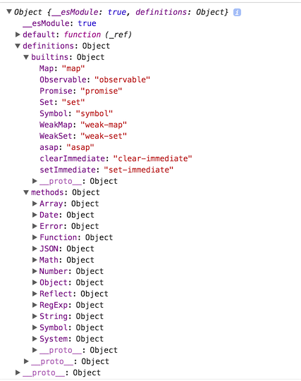

# babel 

## 安装使用

可以用命令行, 作为包直接用script引入页面中或者作为webpack的插件等多种方式
[http://babeljs.io/docs/setup/](http://babeljs.io/docs/setup/)

## CLI

[http://babeljs.io/docs/usage/cli/#installation](http://babeljs.io/docs/usage/cli/#installation)

babel CLI 建议安装在本地, 不建议全局安装

 **原因**

- 不同项目可以使用不同的babel版本
- 同时使项目脱离对当前机器环境配置的依赖, 便于更好的打包发布. 

```
~]# npm install babel-cli -g

```

安装后会添加4个命令

- babel 是编译js文件的全局变量
- babel-node
- babel-doctor
- babel-external-helpers

### babel

这个就是编译js文件的全局变量

### babel-node

这个的作用就是提供一个node命令相同的REPL(read-eval-print-loop)环境，不过这个环境会在执行之前将代码进行编译。

坑1：上文讲到，babel6默认是无法编译es6文件的，需要你手动安装es2015的preset，同样，全局模式下，也需要这个preset。

那么问题来了，我们怎么安装这个preset呢？global？所以这是一个坑，我在babel的issue中找到这样的一条。作者给出这样的回答：我们处理preset和plugin是依据于输入的文件，而你直接运行CLI是没有输入文件的，也就无法定位preset和plugin的位置。言下之意就是不要全局安装，虽然我们给你了你全局安装的方式。然后作者关闭了issue，表示很无奈。。。。

所以，如果大家想体验一下es6的REPL的话，建议安装babel5

### babel-doctor

就是检查babel状况的，
主要检查以下几个内容

是否发现了.babelrc配置文件
是否有重复的babel安装包，比如说安装了5和6
所有的babel安装包是否已经升级到了最新版
并且 npm >= 3.3.0

### babel-external-helpers

就是讲一些公共的帮助函数提取成一个文件，其实就做了这一个作用。。。


## require hook

首先引用babel-register, 该文件会给require添加一个钩子, 在后续require中可以自动编译.

require hook 的作用就是替换原先的require，以便在加载自动对代码进行编译，运行。

其实这个做的便是重写require.extensions中对应的扩展名的加载程序，并且默认会判断这个文件是否是node_modules中的模块，如果是的话，那么将不会进行转换。否则的话，会进行转换。

```
require("babel-register"); 
// 或者
require('babel-core/register');
// 之后require的文件即可以进行编译
require('./app.js')

```

## babel-core

babel 是一个monorepo, 由多个Npm包组合而成. 

Babel-core就是Babel语法编译器，是他在执行Babel的整体语法转换。他向外暴露了一个transform方法，我们可以直接调用babel-core暴露的transform方法，来进行语法的转换。
整个babel的转换过程可以大致表示如下：

```
输入代码 -> babylon parser -> AST -> transformer[s] -> AST -> babel-generator -> 输出新代码
```

从上面的过程中可以看出，babel-core主要用到了babylon，transformer和generator三个工具。

下面我们结合不同的工具对babel的转换过程进行分析：

- 输入代码（如ES6）之后，通过babylon解析器，将代码转换为AST结构，便于后续语法替换
- 利用 babel-traverse 这个独立的包对 AST 进行遍历并解析出整个树的 path，通过挂载的 metadataVisitor 读取对应的元信息，这一步叫 set AST 过程
- 遍历整个AST，并使用不同的plugin对树节点中的语法进行替换
- 通过babel-generator生成新的代码，并将代码保存（如ES5）

通过分析流程，我们可以看到，babel的原理就是一个语法替换的过程。首先解析出语法的AST，在替换AST中节点的语法，最后转换AST为新的代码，从而得到我们想要的结果。


## babel-polyfill

polyfill 是web开发中用来提供一个环境以执行一些原环境不支持的方法的做法. 该词起源于一个腻子粉品牌 Polyfilla, 给浏览器打补丁就像把一个凹凸不平的墙用腻子抹平产生一个光滑的墙. poly- (聚合, 聚集前缀) fill(填充)

[http://babeljs.io/docs/usage/polyfill/#top](http://babeljs.io/docs/usage/polyfill/#top)

This will emulate a full ES2015+ environment and is intended to be used in an application rather than a library/tool. This polyfill is automatically loaded when using babel-node.

This means you can use new built-ins like Promise or WeakMap, static methods like Array.from or Object.assign, instance methods like Array.prototype.includes, and generator functions (provided you use the regenerator plugin). The polyfill adds to the global scope as well as native prototypes like String in order to do this.

polyfill 用来提供一些当前环境不支持的API, 如Object.assign, Promise, Set对象等. babel核心只转换语法, 不会提供这些API. polyfill 会增加提供相应的这些API, 因此polyfill库需要在代码运行之前先引入运行. 并且应该放在dependency而非devDependency

Babel的transform只是进行一些语法的转换，如将箭头函数转换为非ES6浏览器可以识别的普通函数。如果我们需要使用一些ES6+的新的API的话，只是transform是无法办到的，所以这时候就需要添加一些额外的polyfill。
传统的添加垫片的方式有es6-shim，core-js等，这里说明两种常用的babel polyfill方法，babel-polyfill和babel-runtime。

babel-pollyfill和babel-runtime内部使用了core-js和regenerator-runtime，core-js的主要作用是添加一些函数的垫片，而regenerator的作用是兼容ES6/7的generator/async语法。
不过他们两者之间也有区别，babel-polyfill使用时，所有的方法都会添加到全局作用域下，导致全局变量的污染。而babel-runtime会结合babel-plugin-transform-runtime插件，将运行时使用的方法保存到局部作用域下，从而防止方法污染全局变量，也使转换后的文件更轻量。
所以这里推荐使用babel-runtime。

目前最常用的配合Babel一起使用的polyfill是`babel-polyfill`，它会"加载整个polyfill库"，针对编译的代码中新的API进行处理，并且在代码中插入一些帮助函数。

比如说：代码中包含

```javascript

const key = 'babel'
const obj = {
    [key]: 'polyfill',
}

```

使用`babel-polyfill`配合转码后，代码会变成这样

```javascript

function _defineProperty(obj, key, value) {
    if (key in obj) {
        Object.defineProperty(obj, key, { value: value, enumerable: true, configurable: true, writable: true });
    } else {
        obj[key] = value;
    }
    return obj;
}
 
var key = 'babel';
var obj = _defineProperty({}, key, Object.assign({}, { key: 'polyfill' }));

```

使用`babel-polyfill`需要额外安装`babel-polyfill`依赖包，
然后在webpack配置文件中的入口或者公共模块中加入'babel-polyfill'即可，代码如下：

```
entry: {
    common: [
        `babel-polyfill`,
        `whatwg-fetch`,
        `react`,
        `react-dom`,
        `redux`,
        `react-redux`,
        `js-cookie`,
    ],
},

```

### polyfill 源码

```JavaScript

"use strict";
// shim(垫片)中引用了一些ES6的helper函数. Object, Function, Number, Math, String, Date, Array, Regexp 等对象新增的方法以及 Promise, Map, WeakMap, WeakSet Set, symbol等新增的类型. 源码[https://github.com/zloirock/core-js/blob/de6719b9ca437e154663ff10c0eec76260851b01/shim.js]

require("core-js/shim");
// 转化generator函数
require("regenerator-runtime/runtime");

require("core-js/fn/regexp/escape");
// polyfill全局只能引用一次
if (global._babelPolyfill) {
  throw new Error("only one instance of babel-polyfill is allowed");
}
global._babelPolyfill = true;

var DEFINE_PROPERTY = "defineProperty";
function define(O, key, value) {
  O[key] || Object[DEFINE_PROPERTY](O, key, {
    writable: true,
    configurable: true,
    value: value
  });
}

define(String.prototype, "padLeft", "".padStart);
define(String.prototype, "padRight", "".padEnd);

"pop,reverse,shift,keys,values,entries,indexOf,every,some,forEach,map,filter,find,findIndex,includes,join,slice,concat,push,splice,unshift,sort,lastIndexOf,reduce,reduceRight,copyWithin,fill".split(",").forEach(function (key) {
  [][key] && define(Array, key, Function.call.bind([][key]));
});

```

## babel-runtime

[https://www.npmjs.com/package/babel-plugin-transform-runtime#technical-details](https://www.npmjs.com/package/babel-plugin-transform-runtime#technical-details)

`babel-polyfill`解决了Babel不转换新API的问题，但是直接在代码中插入帮助函数，会导致不同的代码文件中包含重复的代码，导致编译后的代码体积变大。
（比如：上述的帮助函数_defineProperty有可能在很多的代码模块文件中都会被插入）

Babel为了解决这个问题，提供了单独的包`babel-runtime`用以提供编译模块的工具函数，
启用插件`babel-plugin-transform-runtime`后，Babel就会使用`babel-runtime`下的工具函数，上述的代码就会变成这样


```javascript

var _defineProperty2 = __webpack_require__("./node_modules/babel-runtime/helpers/defineProperty.js");
 
var _defineProperty3 = _interopRequireDefault(_defineProperty2);
 
var _assign = __webpack_require__("./node_modules/babel-runtime/core-js/object/assign.js");
 
var _assign2 = _interopRequireDefault(_assign);
 
function _interopRequireDefault(obj) {
    return obj && obj.__esModule ? obj : { default: obj };
}
 
var key = 'babel';
var obj = (0, _defineProperty3.default)(
    {}, key, (0, _assign2.default)({}, { key: 'polyfill' })
  );

```

可以看到上述转换后的代码中_defineProperty帮助函数是通过`babel-runtime`下的模块引用的，
同时Object.assign也变成了模块引用, 这样可以避免自行引入polyfill时导致的污染全局命名空间的问题。

使用`babel-runtime`需要额外安装`babel-runtime`和`babel-plugin-transform-runtime`依赖包，
然后在`.babelrc`配置文件中启用`transform-runtime`, 代码如下：

```
{
    "presets": [
        "es2015",
        "react",
        "stage-0"
    ],
    "plugins": [
        "transform-runtime"
    ]
}
```

比较 
 
`babel-polyfill`与`babel-runtime`相比虽然有各种缺点，但在某些情况下仍然不能被`babel-runtime`替代， 例如，代码：`[1, 2, 3].includes(3)`，`Object.assign({}, {key: 'value'})`，Array，Object以及其他"实例"下es6的方法，`babel-runtime`是无法支持的， 因为`babel-runtime`只支持到static的方法。

`babel-runtime`适合在组件，类库项目中使用，而`babel-polyfill`适合在业务项目中使用。


## plugins

babel是一个编译软件, 执行三步, 解析 -> 转化 -> 生成 (parse -> transform -> generation).

需要通过一些插件来设置转化过程要执行的方法, 否则会以原代码输入 -> 原代码输出


## preset

[http://babeljs.io/docs/plugins/#presets](http://babeljs.io/docs/plugins/#presets)

设置preset相当于自动设置一组要执行的plugins. 

preset有 
env
es2015
es2016
es2017
latest (deprecated in favor of env)
react
flow

不同版本的preset env会有不同的plugin组合

### 用法

- 浏览器列表语法 [https://github.com/ai/browserslist](https://github.com/ai/browserslist)
- node: `node: true` , `node: current` 以当前node版本进行编译

```json
{
  "presets": [
    ["env", {
      "targets": {
        "browsers": ["last 2 versions", "safari >= 7"]
      },
      "node": "6.5"
    }]
  ]
}
```

尤雨溪关于preset的看法

[https://www.zhihu.com/question/61124018/answer/184718397](https://www.zhihu.com/question/61124018/answer/184718397)

因为 babel 的存在不只是为了『使用 es 的所有新特性』。它需要考虑如下问题：
如何处理尚未成为标准的提案？ 建议你先了解一下 ECMAScript 的制定流程 (参考: http://wwsun.github.io/posts/new-in-es2016.html )，除了已经正式纳入规范 (ES2015/6/7) 的特性，还有许多处于不同讨论阶段的特性提案 (stage 1/2/3/4)。这些讨论中的特性严格来说还不算是标准，尤其是 stage 1/2 的特性，完全有可能被改动甚至是撤销提案。因此从 babel 的角度来说，显然不能够默认启用这些特性，而需要有可配置的选项让用户自行衡量风险，决定是否使用。
如何针对不同平台的支持情况，减少无用特性的编译。 默认目标通常是 ES5，但其实每个特性都有对应的性能开销，babel 本来速度就不是很快，如果能针对目标平台减少需要处理的特性，可以提高编译效率，也可以尽量使用平台原生的 ES 特性。比如如果只针对最新的 Chrome，大部分插件都是不需要的。有时候你可能只需要一两个特定的插件，比如 syntax-dynamic-import。有时候你可能需要保留一些 ES 特性不编译，比如使用 webpack 2 的时候保留 ES modules 语法不编译为 CommonJS。这些都决定了可配置性是必需的。当然手动配置肯定很麻烦，这也是为什么现在有了 babel-preset-env，可以自动根据目标平台分析需要用哪些插件。
作为一个编译工具链，给予用户实验、甚至是实现非标准的语言扩展的能力。 Babel 的一个重要意义就在于能够让用户提前使用尚未成为标准的语言特性，从而为标准本身的制定提供实践中才能获得的反馈。一个提案靠不靠谱，该不该成为标准？先做个插件出来用到项目里感受一下，比空口讨论靠谱得多。 至于非标准扩展，比如 JSX 并非 ES 标准，但其编译就是完全依赖 Babel 的可配置的插件能力才得以实现的。 另外，babel 作为一个工具链还可以有很多其他用途，比如用来进行编译时的性能优化、测试覆盖率的 instrumentation 等等。
综上，插件化是 babel 存在的核心价值，对于配置的问题，它的答案是 preset；对于题主的需求，用 babel-preset-env 的默认配置即可。另外如果没有以上这些可配置性方面的需求，Buble (https://buble.surge.sh ) 也是一个可以考虑的选择，但 Buble 并不追求与规范 100% 的一致性，是否适合你，需要你自行判断。
需要补充一下的是，不同于以往的babel-preset，babel-preset-env允许你添加运行的环境，并根据你的运行环境添加缺省的插件。


## babel-plugin-transform-runtime

[https://www.npmjs.com/package/babel-plugin-transform-runtime](https://www.npmjs.com/package/babel-plugin-transform-runtime)

```json
{
    "presets": [
        ["env", {
            "target": {
                /*参考 https://github.com/ai/browserslist*/
                "browers": ["Chrome > 30"]
            }
        }]
    ],
    "plugins": [
        ["transform-runtime", {
         // 是否在行内添加helper函数, 默认true
          "helpers": true, // defaults to true 
          // 是否让新的特性(Promise, Set, Map等)使用本地的polyfill(即在本文件内添加相应的polyfill函数), 默认true
          "polyfill": false, // defaults to true 
          "regenerator": true, // defaults to true 
          "moduleName": "babel-runtime" // defaults to "babel-runtime" 
        }]
    ]
}
```


### polyfill参数

如要编译个Promise

原文件为:

```
require('babel-polyfill')
const p = new Promise(function (resolve, reject) {
    setTimeout(()  => {
        resolve('ok')
    }, 100)
})
p.then(res => console.log(res))

```

如果polyfill参数设为false
则编译结果为

```
require('babel-polyfill')
var p = new Promise(function (resolve, reject) {
    setTimeout(function () {
        resolve('ok');
    }, 100);
});
p.then(function (res) {
    return console.log(res);
});

```

若设为true
则结果为, 在本地添加了polyfill函数

```
'use strict';

var _promise = require('babel-runtime/core-js/promise');

var _promise2 = _interopRequireDefault(_promise);

function _interopRequireDefault(obj) { return obj && obj.__esModule ? obj : { default: obj }; }

require('babel-polyfill');

var p = new _promise2.default(function (resolve, reject) {
    setTimeout(function () {
        resolve('ok');
    }, 100);
});
p.then(function (res) {
    return console.log(res);
});

```

### regenerator参数

默认true

转化generator或async函数的 regeneratorRuntime函数是否使用全局的, 使用全局的会污染全局作用域

原文件

```javascript
function* stateGenerator () {
    yield 1
    yield 3
    yield 5
}

const sg = stateGenerator()
let res = sg.next()
console.log(res);
res = sg.next()
console.log(res);
res = sg.next()
console.log(res);
res = sg.next()
console.log(res);

```

值为true时, 编译结果, 不污染全局作用域

```
"use strict";

var _regenerator = require("babel-runtime/regenerator");

var _regenerator2 = _interopRequireDefault(_regenerator);

function _interopRequireDefault(obj) { return obj && obj.__esModule ? obj : { default: obj }; }

var _marked = [stateGenerator].map(_regenerator2.default.mark);

function stateGenerator() {
    return _regenerator2.default.wrap(function stateGenerator$(_context) {
        while (1) {
            switch (_context.prev = _context.next) {
                case 0:
                    _context.next = 2;
                    return 1;

                case 2:
                    _context.next = 4;
                    return 3;

                case 4:
                    _context.next = 6;
                    return 5;

                case 6:
                case "end":
                    return _context.stop();
            }
        }
    }, _marked[0], this);
}

var sg = stateGenerator();
var res = sg.next();
console.log(res);
res = sg.next();
console.log(res);
res = sg.next();
console.log(res);
res = sg.next();
console.log(res);
```

值设为false时, 会使用全局的regeneratorRuntime函数. 

```javascript

"use strict";

var _marked = [stateGenerator].map(regeneratorRuntime.mark);

function stateGenerator() {
    return regeneratorRuntime.wrap(function stateGenerator$(_context) {
        while (1) {
            switch (_context.prev = _context.next) {
                case 0:
                    _context.next = 2;
                    return 1;

                case 2:
                    _context.next = 4;
                    return 3;

                case 4:
                    _context.next = 6;
                    return 5;

                case 6:
                case "end":
                    return _context.stop();
            }
        }
    }, _marked[0], this);
}

var sg = stateGenerator();
var res = sg.next();
console.log(res);
res = sg.next();
console.log(res);
res = sg.next();
console.log(res);
res = sg.next();
console.log(res);
```

### moduleName 

默认是 'babel-runtime'

设置引用helper函数的包的名字/路径.

如设置为
```
{
    'moduleName': 'haha/xixi/runtime'
}
```

则编译后的结果引用helper时

```
var _promise = require('haha/xixi/babel-runtime/core-js/promise');

```

### babel-plugin-transform-runtime 源码解析

插件的源码

[https://github.com/babel/babel/blob/master/packages/babel-plugin-transform-runtime/src/index.js](https://github.com/babel/babel/blob/master/packages/babel-plugin-transform-runtime/src/index.js)



模块导出的对象包括3个属性.
- __esModule: 用来表示该模块是个ES6模块, 
- default: 默认导出的函数, 用来转化ES6代码. 
- definitions属性包含了内置的对象(build-in), 及Array,Object, Number等新增的方法名称

```javascript
// 导出一个函数
export default function ({type: t}) {
    // 返回一个对象
    return {
        // pre方法用来给当前要转换的函数做预处理, 增加帮助函数的引用, 及增加generator函数的运行时帮助函数
        pre (file) {
            
        },
        visitor: {
            // 改变引用识别符  Symbol() -> _core.Symbol(); new Promise -> new _core.Promise
            ReferencedIdentifier () {},
            // arr[Symbol.iterator]() -> _core.$for.getIterator(arr)
            CallExpression () { },
            // Symbol.iterator in arr -> core.$for.isIterable(arr)
            BinaryExpression () {},
            //  Array.from -> _core.Array.from
            MemberExpression: {
                enter () {},
                exit () {}
            }
        }
    }
}

```


## uglifyjs-webpack-plugin

[https://www.npmjs.com/package/uglifyjs-webpack-plugin](https://www.npmjs.com/package/uglifyjs-webpack-plugin)

js压缩插件
该插件默认不支持ES6语法. 对于ES6语法可能会因压缩出错. 
解决方法:
安装
ES6-capable, a.k.a. harmony

```
yarn add git://github.com/mishoo/UglifyJS2#harmony-v2.8.22 --dev

```

如果是压缩ES5

```
yarn add uglify-js --dev
```

```
new UglifyJsPlugin({
  mangle: {
    // Skip mangling these 忽略以下函数的属性.
    except: ['$super', '$', 'exports', 'require']
  }
})
```

## babel module 解析

babel 6 的模块解析不会添加module.exports = exports['default'] = ''

**原文件:**
export文件:

```JavaScript

export default {
    haha: '哈哈'
}

```

原import文件

```JavaScript
import {haha} from './module.export.js'
console.log(haha);
```

** 编译后: **

export文件

```JavaScript

'use strict';

Object.defineProperty(exports, "__esModule", {
    value: true
});
exports.default = {
    haha: '哈哈'
};

```

import文件

```JavaScript
'use strict';

var _moduleExport = require('./module.export.js'); // 导出的对象为 { __esModule: true, default: {haha: '哈哈'}}
console.log(_moduleExport.haha); // 输出undefined

```

**问题:**

原文件的 export default 编译后为 exports.default = {}. 而非module.exports = {} 此时导出的对象是 {default; {}}. 因此在引入的时候会出错. 当然使用ES6对象的解构语法也会出错.

使用的时候可以 const M = require('./export.js').default;  获取模块的default属性可以获取导出模块导出的内容.


### babel-plugin-transform-es2015-modules-commonjs

[https://babeljs.io/docs/plugins/transform-es2015-modules-commonjs/#optionsstrict](https://babeljs.io/docs/plugins/transform-es2015-modules-commonjs/#optionsstrict)

该插件用于把ES6模块转换为commonjs模块, 对于export default会默认转为exports['default']

```javascript
//input
export default 42;
```

```javascript
// output
Object.defineProperty(exports, "__esModule", {
  value: true
});

exports.default = 42;

```

**配置**

```json
// without options
{
  "plugins": ["transform-es2015-modules-commonjs"]
}

// with options
{
  "plugins": [
    ["transform-es2015-modules-commonjs", {
      "allowTopLevelThis": true
    }]
  ]
}
```

**可选参数**

- loose: Boolean 默认 false. 

默认情况下导出的模块会通过defineProperty方法添加不可枚举的__esModule属性, 对于不支持该方法的场景, 需要设置loose为true

```JavaScript
var foo = exports.foo = 5;

Object.defineProperty(exports, "__esModule", {
  value: true
});
```

当loose为true时导出的模块

```JavaScript
var foo = exports.foo = 5;
exports.__esModule = true;

```

- strict: boolean, defaults to false

非严格模式下导出模块会增加__esModule属性, 严格模式不会

- 


## 遇到的坑

- 使用 babel-preset-env 的时候报一些plugin找不到的错误, rm -rf node_modules 再重新安装一下npm包解决. 

- 压缩的插件UglifyJsPlugin需要在babel之后, 因为该插件不会识别新语法, 可能会错误压缩.