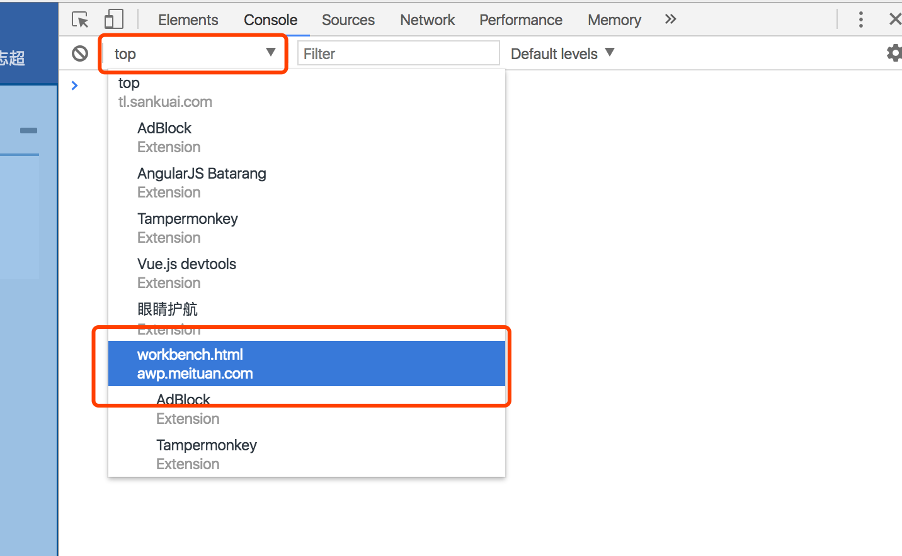

# Chrome 使用技巧

## console 控制台

[官方文档](https://developers.google.com/web/tools/chrome-devtools/console/)

### 选择执行环境

在console中通过选择执行环境, 可以切换到不同的环境中来调试, 如选择某个Iframe的环境, 或一些浏览器插件的环境. 其中 top是顶部环境, 也即当前页面的top环境. 



### console.time

测量执行时间

console.time(string) 启动计时器

console.timeEnd(string) 结束该计时器

```javascript

console.time("Array initialize");
var array= new Array(1000000);
for (var i = array.length - 1; i >= 0; i--) {
    array[i] = new Object();
};
console.timeEnd("Array initialize");

```

### console.count

计数, 记录在同一个地方输出相同内容的次数

```javascript

function login(name) {
  // 对相同的输出数目会递增
  console.count(name + ' logged in');
}

```

### console.group 

对输出分组

console.group() 启动一个带有可选标题的新日志组。以可视化方式将在 console.group() 后、console.groupEnd() 前发生的所有控制台输出组合在一起。

console.groupEnd() 关闭日志组

```JavaScript

function name(obj) {
  console.group('name');
  console.log('first: ', obj.first);
  console.log('middle: ', obj.middle);
  console.log('last: ', obj.last);
  console.groupEnd();
}

name({"first":"Wile","middle":"E","last":"Coyote"});

```


