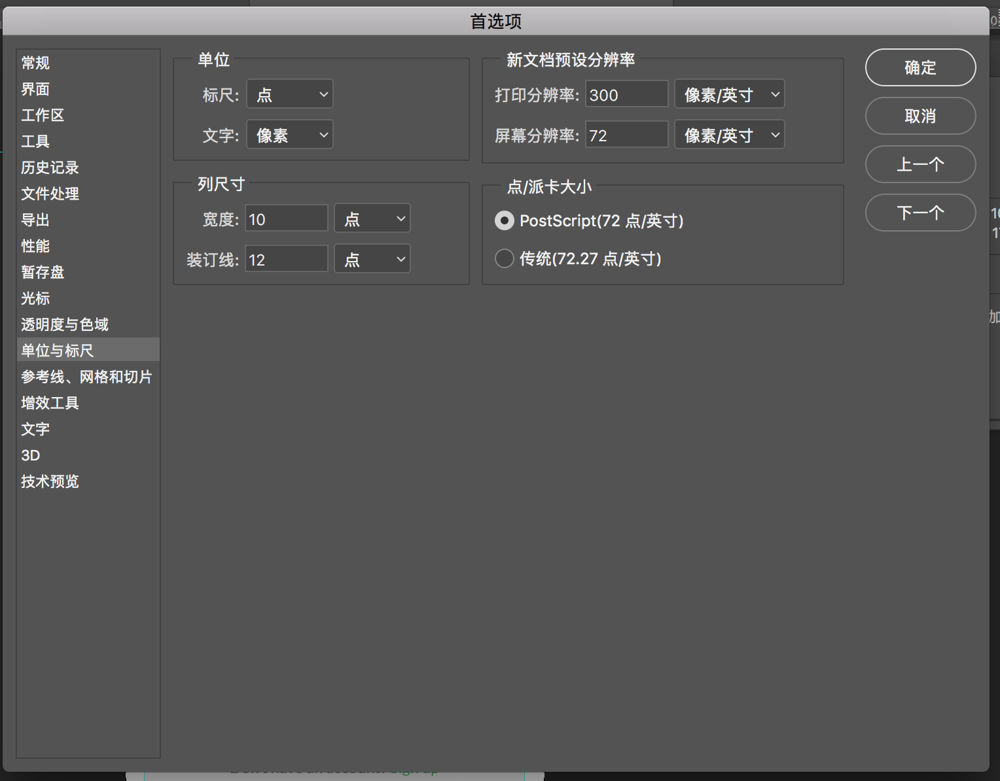
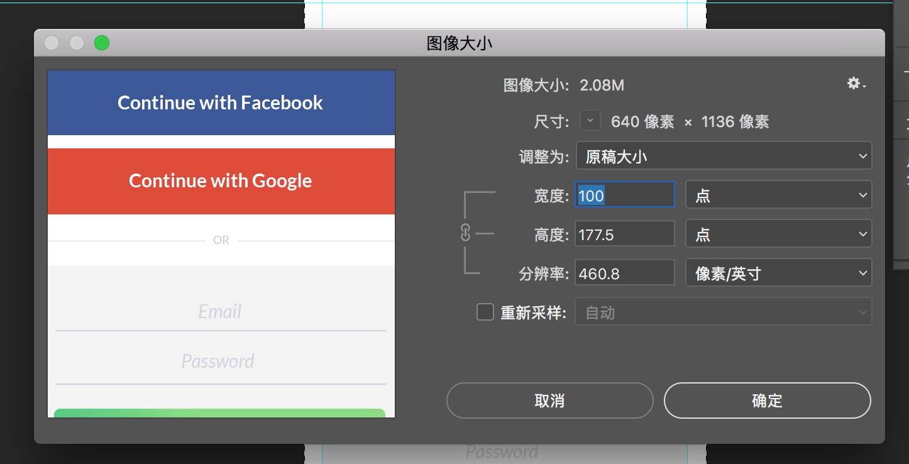
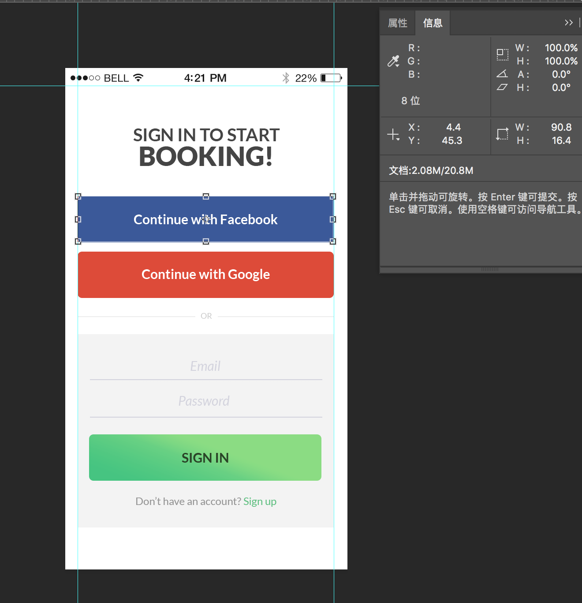
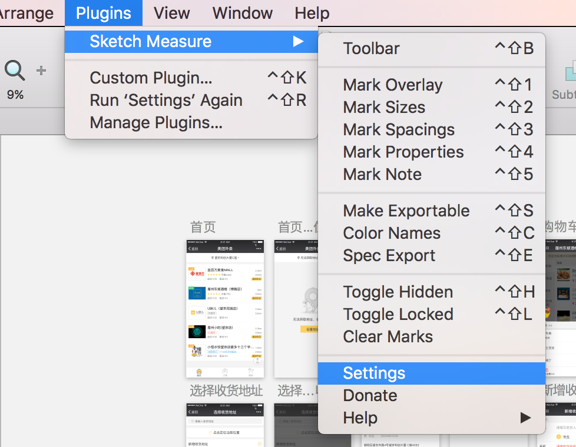
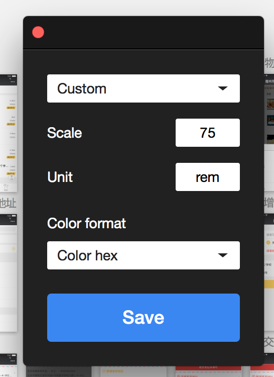
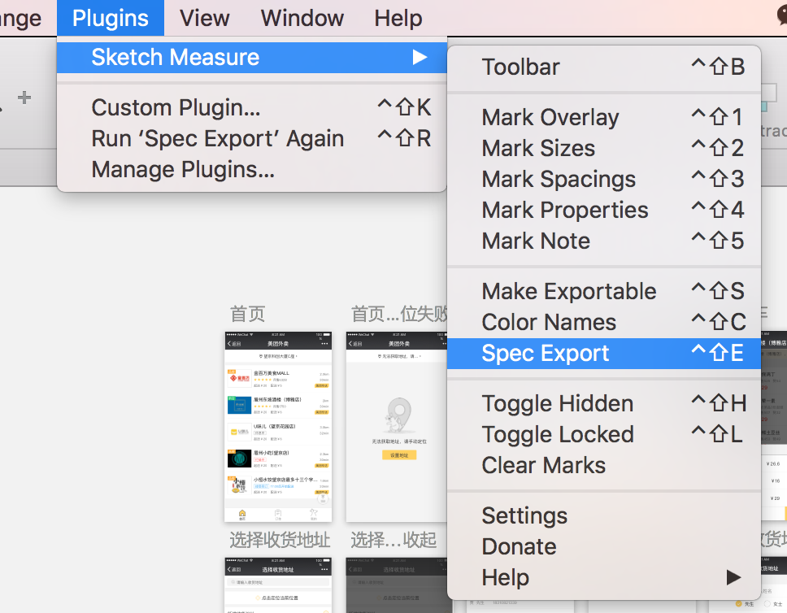
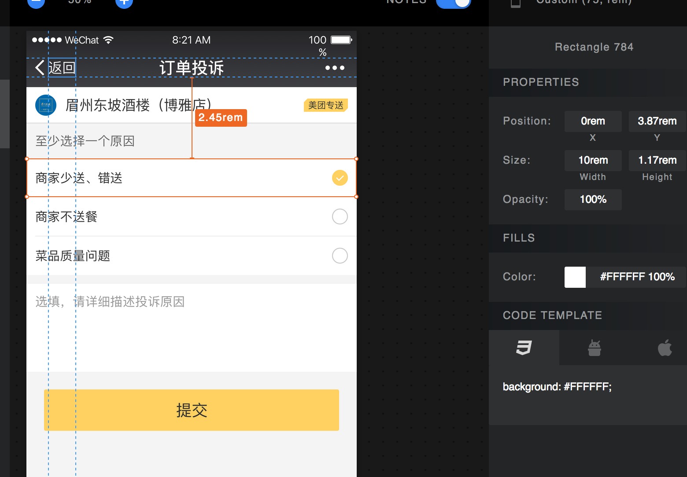

# flexible 布局

## 基本概念

### window.devicePixielRatio: 设备像素比.

获取设备的物理像素与css像素的比.  
通常非视网膜屏幕的值为1. 视网膜屏幕值为2. 
即 视口宽度为320px. 但是实际会用640px的物理像素来显示. 

### 视口的3个概念

- layout viewport 当前页面的css宽度, 即html元素的宽度, 通过该方法可以获取到, document.documentElement.clientWidth
- visual viewport 当前浏览器的可视区域的宽度, 通过window.innerWidth, 也是当前所设置的视口宽度.
- ideal viewport 当前设备的理想视口宽度, 设备出厂时决定, 很多设备会设为320px或375px.

### viewport meta标签

```html

<meta name="viewport" content="width=device-width, intial-scale=1.0, maximum-scale=1.0, user-scalable=no"/>

```

该meta标签用来设置视口, 是由apple引入Safari的, 目的是解决移动设置的viewport问题. 

6个属性

- width: 设置布局的视口宽度, 为正整数或'device-width' 
- height: 设置布局的高度. 不重要. 很少使用. 
- initial-scale: 页面初始缩放倍数. 为数字
- minimum-scale: 最小缩放倍数. 数字
- maximum-scale: 最大放大倍数. 数字
- user-scalable: 是否允许用户缩放. 值为no, yes

### initial-scale和width

**width=device-width**

viewport的meta标签, 如果只设置width属性. 即设置当前的visual viewport. 
当取值为device-width时, 即把视口设为ideal-viewport 在iphone和ipad上，无论是竖屏还是横屏，宽度都是竖屏时ideal viewport的宽度。

**initial-scale属性**

设置当前页面的缩放. 
当设为initial-scale=1.0时, 则表示当前页面不缩放, 此时的视口宽度等于 ideal-width, 与竖屏时 width=device-width 是一样的效果. 

缺陷: 对于wp系统的IE浏览器, initial-scale的ideal-width总是取竖屏时的.

缩放的比例的含义. 
缩放的比值等于 ideal viewport / visual viewport, 即 理想视口宽度 / 可视区域的宽度
比值越大, 则表示放大的越大, 因此可视区域越小
值为1.0时, 此时 宽度可视区域宽度为ideal viewport
值为0.5时, 此时 visual viewport = 375 / 0.5 = 750px

** 当width=400 和 initial-scale=1 同时出现的冲突处理. **

initial-scale更通用一些. 
当2者同时出现, 会取两者之中较大的值, 如对于iPhone6而言, ideal viewport 为375. 此时设置了width=400, initial-scale=1 则会取400. 


## 布局原理

flexible布局的本质是模拟vw 将屏幕分成100份, 按屏幕宽度的百分比进行布局. rem只是vw的变体(10rem = 100vw). 

通过给不同屏幕的设备动态设置对html元素设置不同的font-size. 其他元素采用rem布局. 以使不同的屏幕都能适应相同的样式. 

对于文字或某些不需要放大的图片等元素继续采用px设置一个不会等比缩放的宽度. 并通过dpr来适配devicePixelRatio不同的屏幕如视网膜屏幕. 

移动设备的尺寸 

iphone6:    375px*667px  实际像素：750px*1334px

iphone5:   320px*568px   实际像素：640px*1136px

iphone4:   320px*480px   实际像素：640px*960px

nexus5X(安卓)： 411px *731px 实际像素：411px＊731px

### 实现

- 1. 设置dpr. 

根据设备的 window.devicePixelRatio 设置dpr

取 1, 2, 3 三个值

dpr = dpr >= 3 ? 3 : dpr >= 2 ? : 2 : 1;

- 2. 设置initial-scale

设置 viewport meta 的initial-scale = 1 / dpr

- 3. 设置html的data-dpr属性

document.documentElement.setAttribute('data-dpr', dpr);
用于字体等不需要等比放大的元素以px作为单位自定义设置字号尺寸.

如 
```css

div{
	font-size: 25px;	
}
[data-dpr="2"] div{
	font-size: 50px;	
}
[data-dpr="3"] div{
	font-size: 150px;	
}

```

- 4. 动态设置html的font-size 作为rem单位的参考

在DOMContentLoaded或窗口resize的时候都会重新设置html的字号

如果视口宽度 实际width / dpr 超过540, 则取540.

设置html元素的font-size为 width / 10; 以此来实现 1rem = 10% width 


## 布局具体使用


### 1. 设计师以iPhone6的尺寸为基准进行设计. 出一份宽750px的设计图. 交给前端. iPhone6的视口为375px * 667px

### 2. 引入lib-flexible 库

```html
<script src="http://g.tbcdn.cn/mtb/lib-flexible/{{version}}/??flexible_css.js,flexible.js"></script>
```

这个库会为html元素增加data-dpr属性及font-size样式.

如此一来页面中的元素都可以使用rem来设置. 会根据html的font-size的值做相应的计算. 
如html的font-size为37px. 则1rem=37px 如width设为2rem. 则相当于74px. 

flexible 实际上是通过js来设置了一个meta标签. 

主要做了以下事情

动态改写meta标签
给html元素添加data-dpr属性. 并设置data-dpr的值
给html元素设置font-size属性. 作为rem的基准值. 

### 将设计稿中的px单位转换为rem

设计稿有640px, 750px, 1125px三种. 

把设计稿分成100份来看待(为了兼容未来的vw, vh单位, 视口的1%宽高). 1份为1a, 1rem为10份 10a, 对于750px的设计图来说, 1rem=750 / 100px * 10 = 75px.

如设计图中某个图片为230px * 230px. 则转为rem为 230 / 75 = 3.067rem

### 文字的处理

对于文字不适合使用rem

因为我们在不同的屏幕(普通屏幕和retina屏)上, 希望看到的文字字号是相同的. 即不希望在retina屏幕上文字变小, 同时希望在大屏幕上看到更多的文本. 因此对于字号不适合使用rem来缩放

在flexible布局方案中, 文字依然使用px作为单位, 不过使用[data-dpr]属性来区分不同dpr下的文本字号大小. 

```css

div { width: 1rem; height: 0.4rem; font-size: 12px; // 默认写上dpr为1的fontSize } 
[data-dpr="2"] div { font-size: 24px; } 
[data-dpr="3"] div { font-size: 36px; }

```

实际开发中可以定制一个font-dpr()的sass混合

```sass

@mixin font-dpr($font-size) {
	font-size: $font-size;
	[data-dpr="2"] & {
		font-size: $font-size * 2;
	}
	[data-dpr="3"] & {
		font-size: $font-size * 3;
	}	
}

```

有了这样的混合宏之后，在开发中可以直接这样使用：

```sass

@include font-dpr(16px);

```

当然这只是针对于描述性的文本，比如说段落文本。但有的时候文本的字号也需要分场景的，比如在项目中有一个slogan,业务方希望这个slogan能根据不同的终端适配。针对这样的场景，完全可以使用rem给slogan做计量单位。


## lib-flexible 方案的优缺点

这个方案的好处呢, 有几个:

- 使用 rem 来模拟 vw , 对低版本浏览器的兼容性更好
rem , 即 root element (<html>) 的 font-size, 是在执行环境中计算出来的, 比 vw 更可控一些. - 在某些情况下, 开发者可以选择打破 "10rem = 屏幕宽度" 这个假设
一套切图适应多种手机屏幕, 投入产出比高
- rem 做布局单位, px 可以解放出来做物理像素单位, 实现1物理像素细边框(需要使用正确的 viewport)
缺点呢, 也很明显:
- 方案提倡工程师在设计稿/标注上量得 px, 再转换成代码中的 rem, 实际上是多此一举
1rem是屏幕宽度百分比单位, 没有考虑到屏幕物理尺寸的差别, 控件在大屏幕下很大, 在小屏幕下很小
实际上是整体缩放布局, 没有适应屏幕的宽高比, 在横屏和纵屏下给人的观感不一致
lib-flexible 方案的适用范围

总结了以上提到的种种优点缺点, 我们就可以因地制宜地思考何时使用这个方案了.

- 用户的屏幕的物理尺寸和宽高比相差不大, 例如主要面对手机用户, 并且 app 锁定竖屏的情况
- 布局是基于宽度的, 而非基于高度的. 如 fullpage 这种要求宽高都要适应, 不能出现滚动条的情况, 就不太适合照搬这个方案.
- 资源有限, 不足以提供对各种屏幕提供充分适应的完美方案

### 对 lib-flexible 方案的改进

- 改进点1: vw/vh/vmin/vmax

lib-flexible 用 rem 模拟 vw 这个做法, 只是出于淘宝的实际情况, 设计稿大多是商品/列表展示型页面, 允许纵向滚动条, 要求页面在横向上充分适配.
在实际的工作中, 这种情况固然是最普遍的, 但也有一些特殊的情况需要考虑, 例如全屏展示型的 H5 营销广告页面, 要求在横向和纵向上都不出现滚动条, 并且页面主体内容不溢出屏幕显示区域之外, 这时我们就可以用 vmin 来代替 vw.

- 实际上 css3 提供了4个与 viewport 宽高有关的比例单位 vw/vh/vmin/vmax, 我们必须充分理解, 并且加以合理利用, 切不可生搬硬套别人的做法.

- 改进点2: 抛弃 px2rem

lib-flexible 社区现在有一种迷思, 工程师在设计稿/标注上量得 px, 再转换成代码中的 rem (px2rem), 实际上是完全不必要的.
以 Android 界面单位为例, 通行的做法是, 设计稿上量出来直接就是 dp, 工程师写的代码中也是 dp 单位, 工程师在整个工作过程中几乎不需要去接触设计稿像素单位, 也不需要接触屏幕像素单位.
那么照搬这种做法, 在使用 lib-flexible 时, 我们直接取标注单位为 rem 就可以了.

具体操作如下:

改进点2.1 在 Photoshop 中取 rem 单位

1. 打开 "首选项→单位和标尺", 将 "标尺单位" 改成 "点"



2. 打开设计稿, 将像素大小改成100点, 并且去掉 "重新采样"

3. 再在设计稿中量得的任何尺寸, 在标尺中展示的单位都是"点", 即屏幕宽度的1％

4. 将量得的"点", 小数点左移1位, 即为写入css代码中的 rem 数值, (10rem = 屏幕宽度, 即 10rem = 100点, 即 1rem = 10点)
这种做法, 量得的数值精度为1‰设计稿宽度, 对设计宽度<1000像素的设计稿都适用.

改进点2.2 在 Sketch Measure 中取 rem 单位
Sketch 和 Sketch Measure 是非常流行的设计稿标注组合, 在这对工具里, 我们依然可以直接输出 rem 标注, 并且做法更为简单直接

1. 打开 sketch 设计稿, 进入 measure 设定

2. 设置如下自定义单位, scale 为设计宽度/10, unit 为 rem, 例如 750 的设计稿, scale 输入 75

3. 点击 Spec Export

4. 最终导出的 index.html 标注中所有的标注都是可以直接使用的 rem 数值



这种做法, 量得的数值精度为小数点后2位, 即1‰设计稿宽度, 对设计宽度<1000像素的设计稿都适用.


## 参考资料

[https://www.w3cplus.com/mobile/lib-flexible-for-html5-layout.html](https://www.w3cplus.com/mobile/lib-flexible-for-html5-layout.html)

源码: [https://github.com/amfe/lib-flexible](https://github.com/amfe/lib-flexible)


