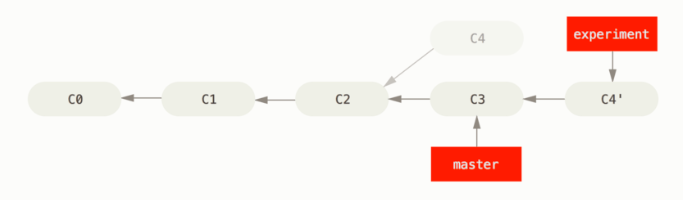

[TOC]

# git 操作笔记

### 基本概念


git中的文件有3种状态.

modified(已修改), staged(已暂存), commited(1已提交)

相应的git项目中有3个文件流转的工作区域

- workding directory 工作区
- staging area 暂存区
- repository 仓库 


### git log 查看commit记录

- git log --pretty=oneline 以一行来查看

```bash
128f22e73214b375d8cbdd0249df08a86e234459 开发票种聚合
c71de8f2da3d03d75f8893ab3ff63f62626313fa publish branch: master
7711685bcf82c1c90f26b24b6042472a64c839e3 Merge pull request #83 in HFE/hotel-hfe-luban-crm from zc/weather-tip to master
8ee45a4ba841d549d9c7918229beb0037478e05d 更新crm-weather-tip
33e0550e184727e46964621ff256e31ec5336b7c 更新

```

- git log --stat 输出一个diffstat, 显示文件修改的简要统计.


```bash
commit dd76ced3b8fba1349b57a2c1845d04e07ab25cd6
Author: xuzhichao03 <xuzhichao03@meituan.com>
Date:   Wed Jun 21 17:19:58 2017 +0800

test-st

build/staging/common.28cee198b775c1a725b8.js       | 10 ++++++++++
build/staging/common.531aa76be24862457357.js       | 10 ----------
build/staging/index.html                           |  2 +-
...585cc.js => poi.bundle.c3b40363bc680ca3cbea.js} | 10 +++++-----
build/staging/poi.html                             |  2 +-
build/staging/workbench.html                       |  2 +-
repo-info.json                                     |  2 +-
.../subView/baseInfo/baseInfo.controller.js        |  1 -
src/app/poi/poiDetail/subView/tradeInfo/index.html |  2 +-
.../subView/tradeInfo/tradeInfoController.js       |  2 +-
10 files changed, 21 insertions(+), 22 deletions(-)

```

### git checkout 切换分支或者恢复工作区的文件

#### git checkout [<branch>]

切换分支, 如果本地没有该分支, 而remote有, 则会切换到新分支并关联远程分支, 相当于 git checkout -b <new branch> --track <remote>/<branch>, 

#### git checkout -b <new branch> [<start point>] 

 创建并切换到新分支, 如果指定start point(commit hash)则会从该commit切换出去, 新的分支的最后一个commit为start point指定的commit

#### git checkout [-p|--patch] [<tree-ish>] <pathspec>  恢复一个文件或目录

pathspec: 文件或文件夹路径
tree-ish: tag, tree 或 commit, 默认是当前的commit

如果有 -p参数 或者 pathspec, 则不会切换branch, 而是从 tree-ish指定的commit|tag中提取该文件|目录到工作区.

如:

```bash
 # 从index commit 中提取README.md 文件当当前的working tree.
git checkout README.md

 # 清除当前工作区的更改
git checkout .

``` 


### git merge 合并分支

如master分支commit历史为 A -> B -> C -> D
dev分支commit历史为 A -> B -> E -> F -> G

在dev分支要合并master分支. 那么


```bash

git checkout dev // 切换到dev分支
git merge master // 合并master分支

# 如果有冲突会产生冲突文件. 解决完冲突后. 再建立新的commit

git add .
git commit -m merge-master-to-dev

# 那么此时dev的commit历史如下. 并入的master的历史会跟在分支节点的后面.

A -> B -> C -> E -> F -> G -> merge-master-to-dev

# 查看合并的提交及父提交的关系图

git log -10 --graph --stat --pretty=oneline 

*   e660fa47d3589c5cdfe45c881b54e74182bdac74 merge-dev-to-dev3
|\
| * 975ed1141c1a451dde940d814e321780f07a258e b
| |  1.md | 7 +++++++
| |  1 file changed, 7 insertions(+)
| * c6196205ac27f9721950dd0685e3c4170ba81ecd a
| |  1.md | 5 +++++
| |  1 file changed, 5 insertions(+)
| * 55b075a080fc851798e48ab1087cd398ee886185 dev2-m1
| |  a.md |   11 +
| |  b.md | 2223 +++++++++++++++++++++++++++++++++++++++++++++++++++++++++++++++++++++++++++++++++++++++++++++++++++++++++++++
| |  2 files changed, 2234 insertions(+)
* | 634b8742b03a9fe89da95051f93b70deffca5a19 e
| |  1.md | 4 ++++
| |  1 file changed, 4 insertions(+)
* | 7cdaffd5940d4d14b846b6c88225d405e59a6ffb d
|/
|    1.md | 6 ++++++
|    1 file changed, 6 insertions(+)
* 61a6d4132bbdaed67f48083cec82492c3e40fa2f dev2-2
|  a.md | 4 +++-
|  1 file changed, 3 insertions(+), 1 deletion(-)

```

对于merge的commit, 如果reset到merge的分支, 则会回到刚merge的状态. 此时如果git checkout . 则会直接恢复到merge之前的状态. 虽然commit中有另外一个分支的commit历史, 但是并不会回到这些历史状态.


### git rebase 衍合

可以参考 [http://iissnan.com/progit/html/zh/ch3_6.html](http://iissnan.com/progit/html/zh/ch3_6.html)



git rebase <new base> [<now branch>]

用于把一个分支的修改合并到当前分支。

与merge的不同: 
merge 如果2个分支是发生了分叉, 则会生成一个新的分支, 该分支有2个父分支.
rebase 如当前在dev分支, git rebase master. 则会以master的最后commit为基底分支逐个执行dev分支的commit, 并且可以合并commit提交. 然后再切到master分支, git merge dev 则可以生成一个干净的commit历史. 

```bash

 # rebase的流程
 # 如下的分支, 当前在dev分支, 最终要合并到master分支

      A---B---C dev
     /
D---E---F---G master
 
 # 执行 git checkout dev => git rebase master
 # 则会查找到2个分支的共同父节点E, 以G为基底, 将 A, B, C 生成多个patch(补丁), 在G的基础上依次应用各个补丁, 遇到冲突会提示用户处理冲突, 若无冲突则自动合并并应用下一个补丁
 # 冲突处理完通过 
 git add . //添加到暂存区
 git rebase --continue // 继续下一个commit patch的应用. 

 # 取消 rebase
 
 git rebase --abort 

 # rebase完成生成如下的记录. A', B', C' 这些commit可以通过 squash模式进行合并

             A'---B'---C' dev
             /
D---E---F---G master 

 # 将rebase后的分支合并到master

 git checkout master
 git merge dev

```

#### git rebase --onto master server client

取出client分支, 找出client和server分支的共同祖先之后的变化, 将这些变化以master的最后commit为基底重演一遍.


#### git rebase -i <branch name>

git rebase -i master // 在当前分支上 rebase master分支

interactive 交互式的执行rebase, 会打开命令编辑界面. 输入每个commit的合并执行策略. 保存退出后即开始执行.  

如果没有分支参数

#### git rebase -i HEAD~4  重新录入last 4 commits, 可以将其合并为1个

合并当前分支的前4个commit为一个. 只合并commit message, 仍然会保留每个commit所做的文件变更.

或者 git rebse -i <commit-hash> 会重写从当前commit 到指定hash的commit记录

### 冲突处理

对于大部分的冲突git都可以自动处理. 
需要手动处理的冲突包括:
- 文件冲突: 两个分支同时修改了同一个文件的同一部分.
- 树冲突: 两个分支同时修改了同一个文件的文件名. 


**冲突处理**

- git merge --abort 取消merge
- 解决冲突. 打开冲突的文件, 手动解决冲突. 然后在 git add . => git commit 

- git diff 查看冲突的部分

```bash

diff --cc repo-info.json
index cfbf0d9,0c36e7c..0000000
--- a/repo-info.json
+++ b/repo-info.json
@@@ -16,6 -17,5 +17,10 @@@
    "currentTag": true,
    "toTest": [
      "test01"
++<<<<<<< HEAD
 +  ],
 +  "timestamp": 1498113885407
++=======
+   ]
++>>>>>>> master2
  }

```

树冲突处理
如 master分支有文件 1.md

```bash
	# 从master切换分支tree1
	git checkout -b tree1
	mkdir 1
	mv 1.md 1 // 把文件1.md 移动到 文件夹 1 下面

	# 从master切换到分支 tree2
	git checkout master
	git checkout -b tree2
	mkdir 2
	mv 1.md 2 // 文件1.md 移动到 文件夹 2下面

	# 合并产生冲突

	git checkout tree1
	git merge tree2

	# 输出

	CONFLICT (rename/rename): Rename "1.md"->"1/2.md" in branch "HEAD" rename "1.md"->"2/1.md" in "tree2"
	Automatic merge failed; fix conflicts and then commit the result.

	# 此时查看状态 

	git status

	Unmerged paths:
	  (use "git add/rm <file>..." as appropriate to mark resolution)

		added by us:     1/1.md
		both deleted:    1.md
		added by them:   2/1.md

	# 冲突的解决
	# 手动保留需要的版本, 并删除不需要的版本. 然后 
	git add. 
	git commit -m fix-conflict

```

#### 冲突标记风格

通过 git config --add merge.style [value] 可以设置冲突的标记风格
可选值
- merge 默认. 以 <<<< 本地更改的版本 ==== 他人更改的版本 >>>> 来表示
- diff3 以 <<<< 本地更改的版本 ||||| 原始版本  ======  他人修改的版本 >>>>> 来表示

```bash
	# 文件冲突 ==== 前面是自己的分支, 后面是merge的分支

	<<<<<<< yours:sample.txt
	Conflict resolution is hard;
	let's go shopping.
	=======
	Git makes conflict resolution easy.
	>>>>>>> theirs:sample.txt

```

### git commit 

提交

git commit --amend 修改上次的commit信息


### git blame

查看文件的修改记录

git blame README.md

```bash
git blame README.md
 # 输出 该文件的修改历史记录
6f24c770 (weihanqing  2016-10-07 11:26:08 +0800 19) 访问前缀为 test...
^acad07f (weihanqing  2016-10-07 11:24:08 +0800 20)
8c25408b (xuzhichao03 2017-01-23 12:40:31 +0800 21) #### 发布st
849fa190 (xuzhichao03 2017-01-11 12:25:48 +0800 22)
6f24c770 (weihanqing  2016-10-07 11:26:08 +0800 23) 访问前缀为...

```


### git tag

** git 可以设置tag **

创建tag

- git tag -a <tagName> <commit hash> -m <tagMsg> // 创建一个tag, tag名默认不能重名
- git tag -f <tagName> -m <tagMsg> // 如果tag已存在, 在替换该tag, 也即update 该 tag

** listing tag **

- git tag -l // 展示tag名
- git tag -n <n> // 打印 n行的tag 及 tag message
- git show-ref --tags // 打印所有的 tag 及对应的 commit信息.

** 删除tag **

- git tag -d <tagName> // 删除tag

** 推送tag到远程仓库 **

在git push 的时候默认不会推送tag信息

- git push origin v1.5 // 可以把 v1.5 tag 推送到origin仓库
- git push origin --tags // 推送所有的远程服务器没有的tag到远程服务器.

推送到远程服务器的tag 在git pull的时候会被.

** tag 应用 **

- git show <tagName> // 查看该tag的详细信息, 包含文件的变化.


### git diff

比较差异

git diff <commit A> // 比较工作区与版本A的差异
git diff <commit B> <commit A> // 比较两个版本的差异
git diff --cached <commit A> // 比较暂存区和版本A的差异
git diff // 比较工作区和暂存区的差异
git diff --cached // 暂存区和HEAD
git diff HEAD // 工作区和HEAD比较

### git 历史回溯

**修改上次的commit**

git commit --amend 
只能修改上次的commit 信息, 由于提交了commit又想修改的情况比较多, 所以该操作相当于git提供的一个快捷修改方式.


### git show-ref 

List references in a local repository 查看仓库的引用

git show-ref --heads // 只列出heads
git show-ref --tags // 只列出有tag的commit

```bash

git show-ref

 # 输出

55b075a080fc851798e48ab1087cd398ee886185 refs/heads/dev
650848765a3a91ba8d5194583179dbbd88f1aa95 refs/heads/master
f183f36a8f21d23b99a7b21f47bf3f3e251476cf refs/heads/test
f95fc134bd6f8ebf141cb2e684a6e187e88aae03 refs/tags/tag1
1cec75aa0b3189a009a54d8916e004f58e9cf9ca refs/tags/tag2
608a7cc2984697e497c575e579a5171d3c08a326 refs/tags/tag3

```

### git reflog 引用记录(reference logs)管理 reflog 信息

git reflog -5 HEAD // 输出最近的5次HEAD的指向改变历史

### Detached HEAD 游离的HEAD

git checkout 可以进入历史记录的某个commit, 此时进入了一个detached branch. 可以做一些试验或者修改. 不会影响该branch的记录历史.

```bash

 # 如当前master分支为

a -- b -- c (HEAD指向c)
     |
  tag v1.0


 # master分支再提交一次commit则为


a -- b -- c -- d (HEAD指向master分支 d commit)
     |
  tag 'v1.0'


 # 此时如果要切到commit b, 并且不指向任何分支. 可以通过以下方法. 

git checkout master^^ 
 # 或者
git checkout v1.0

 # 经过以上操作, 此时

   HEAD 指向commit b
     |
a -- b -- c -- d (HEAD指向一个游离分支 [detached branch], commit b)
     |
  tag 'v1.0'

 # 在当前分支再commit e, 此时的 commit e 只被HEAD引用, 而没有branch引用. 

   HEAD 指向commit e
     |
     e
     |
a -- b -- c -- d (HEAD指向一个游离分支 [detached branch], commit e)
     |
  tag 'v1.0'

 # 此时位于游离分支, 在游离分支也可以做所有的git操作, 但是如果切换到其它分支, 如 git checkout master. 则HEAD会指向master分支commit d
. 此时的commit e 没有被引用, 在下次git垃圾回收的时候会清除该游离分支上的commit.

 # 通过在该游离分支commit e上创建一个新的分支, 或tag可以保存该游离分支的改变. 以下的3个操作都可以创建新的引用

git checkout -b foo // 创建新的分支foo引用commit e, 同时把HEAD指向foo分支(即切换到foo分支)
git branch foo // 创建foo新分支引用commit e, 仍然停留在当前分支, 不切换过去
git tag foo // 创建新tag foo. HEAD离开游离分支

 # 如果离开了游离分支, 并且没有创建引用, 但是现在需要回到刚才的游离分支. 可以通过以下操作.

git reflog [-n] HEAD // 输出最近的n次引用变更记录, 找到刚才从游离分支切换出来的那个HEAD序号,比如是m
git checkout HEAD@{m} // 切换到刚才的游离分支

git log -g [-n] HEAD // 也可以输出引用的变更记录

```


