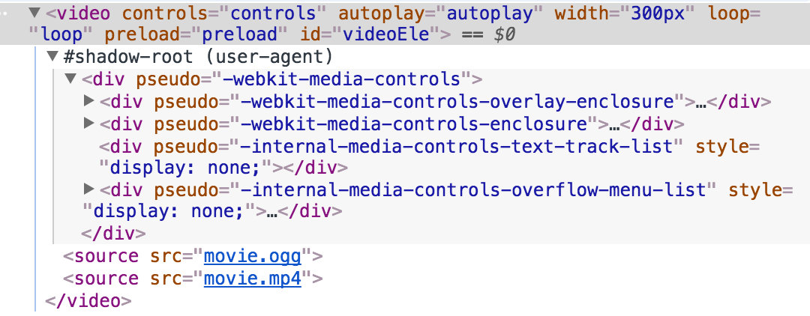
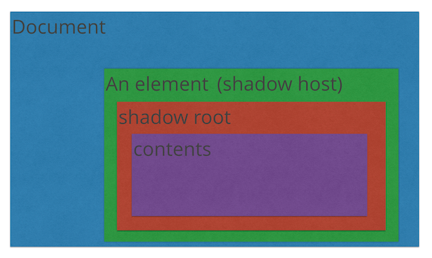

# shadow dom

Shadow DOM 对 Web Component 中的html和css封装在一起, 形成一个web组件. 如 video 标签会生成一个shadow dom, 用来设置其控件样式.

shadow dom 独立于document文档, 其样式属性不会泄露到外部, 外侧的样式也不会影响到shadow dom, 可以方便的用来定义组件.



shadow-dom 在控制台中默认不展示, 可以通过 setting - preferences - Elements - Show user agent shadow DOM  显示 shadow dom

## 结构

- shadow host 宿主标签
- 根节点 #shadow-root
- contents 内容

shadow-dom 还可以进行嵌套



## 创建shadow dom

```javascript

var box = document.querySelector('div');
// 创建shadow root
var shadowRoot = box.createShadowRoot(); 
// 设置内容, style标签可以设置样式, 样式不会泄露到外面.
shadowRoot.innerHTML = '<style>p{color: red;}</style><p>我是影子dom</p>'; 

```

## web components

将html,css, js封装为一个可以在不同的框架之间通用的组件,

主要使用的技术有

- shadow DOM, 
- HTML 模板(template), 
- 模板导入, <link rel="import" href="my-component.html">
- 自定义元素: 通过 customElements.define('my-component', element); 来注册一个自定义元素my-component, 该元素封装了相应的样式及js逻辑

通过以上方法来实现一个web component
