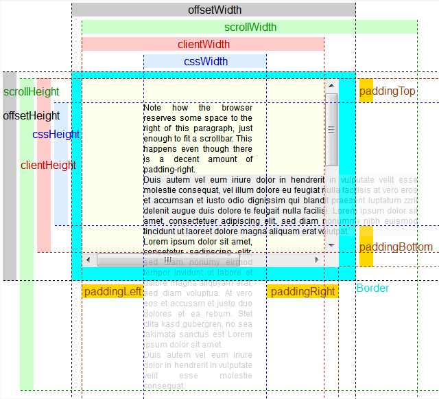

# js获取元素尺寸

## 元素 

### 获取元素的尺寸

参考 [https://stackoverflow.com/questions/21064101/understanding-offsetwidth-clientwidth-scrollwidth-and-height-respectively](https://stackoverflow.com/questions/21064101/understanding-offsetwidth-clientwidth-scrollwidth-and-height-respectively)

盒模型中通过css设置的尺寸只可以获取width, padding, margin, border. 而无法获取元素参与布局的一些属性.
因此每个dom元素自身提供了3对新的只读dom属性来获取当前元素的显示布局属性, 这些属性的值都是integers

- offsetWidth, offsetHeight: width + padding + border 当前元素的尺寸包括 
- clientWidth, clientHeight: clientWidth - border - scrollbar 元素可见内容的尺寸. 不包括border, 和scrollbar(滚动条一般为17px会占用padding的宽度. 但chrome中scrollbar不占用padding, 即获取到的scrollbar的尺寸为0).
- scrollWidth, scrollHeight: parentEle.paddingTop + parentEle.paddingBottom + innerEle.offsetHeight + innerEle.marginTop + innerEle.marginBottom 当前元素的整个内容的尺寸, 包括超出视图(需要滚动显示)的部分, 以及当前元素的上下padding. 该尺寸无法通过css计算, 取决于内容物的大小

### 获取当前网页的尺寸

获取当前可见部分的视口的宽高, 可以通过获取documentElement元素的offsetWidth, offsetHeight 来获取. 包含该元素的width + padding + border. 不包含margin.
对于可使用部分可以获取其 clientWidht, clientHeight. 包含width + padding

- body.clientWidth, body.clientHeight. 获取body可用内容的尺寸. 不包括border
- body.offsetWidth, body.offsetHeight. 获取body可见内容的尺寸. 包括border, 不包括margin

获取当前网页的大小, 对于超出需要滚动的页面包含超出部分. 则可以获取body的scrollHeight, scrollWidth.  包含 内容元素的 content.offsetHeight + content.marginTop + content.marginBottom + body.paddingTop + body.paddingBottom

### 当前元素在页面中的位置.

offsetParent 是当前元素获取位置时的参考对象. 无论自己是否定位, 其offsetParent都是离自己最近的已经定位了的父元素. 如果父盒子都没有定位, 则是root element(body或html) 或者父元素中离自己最近的table cell.

offsetLeft, offsetTop 是自己的border外侧到offsetParent的border内侧的距离.

## 事件的尺寸位置属性

事件触发时可以获取到3对属性

- event.clientX, event.clientY 到当前浏览器内容左(上)的距离
- event.screenX, event.screenY 到当前显示器左(上)的距离
- event.offsetX, event.offsetY 事件在触发事件的源元素(最内层元素)中的x, y坐标(从border内侧开始计算). 如果点击到border上则offsetX / offsetY 为负值

