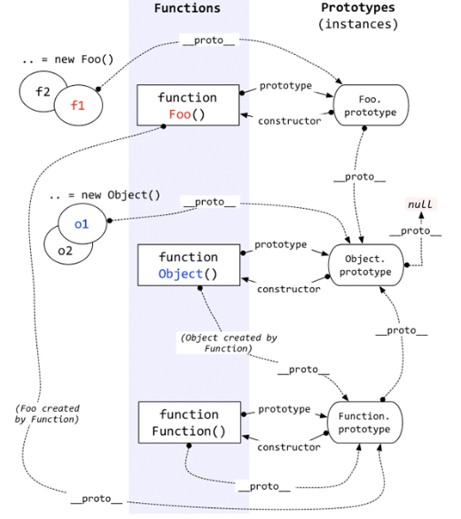
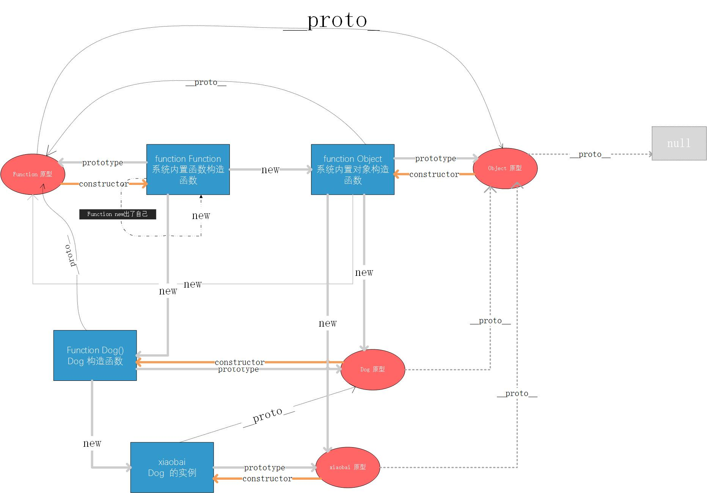

# js原型链根源探索

### 1. js中两条线的根源

>* 构造函数 : 	构造函数的根源是function Function(系统内置的函数的构造函数)

>* 原型链条继承 : 原型链的继承最终追溯到Object的原型上, Object的原型的__proto__ 指向了null. 即原型链的继承可以追溯到null;

### 1. js初始

1. js中先创造了 function Function (function的构造函数);

2. Function new出了自己(实际并没有,为了方便理解所以才这样考虑.), 也new出了Object(对象的构造函数).

3. Object的构造函数(function Object)  系统中的对象都由它来创建; 系统中所有对象的 __proto__  最终都指向了 Object的prototype(原型);

4. Object.prototype.__proto__ 指向了null;

5. 系统中的其他__proto__, prototype, constructor 的指向都可以由此推出来.

6. Function 构造函数,创建出了所有的基本类型的构造函数, Array, Number,String,Boolen等

