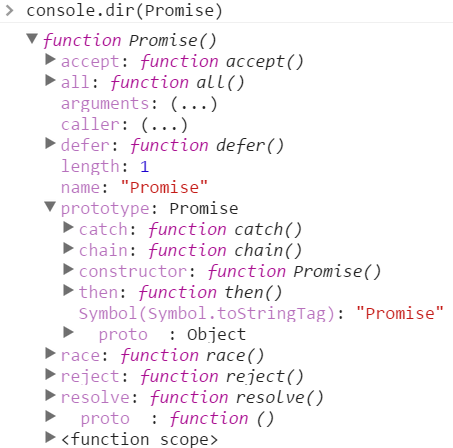

# promise 对象深入分析

参考资料: 

[http://www.tuicool.com/articles/RzQRV3](http://www.tuicool.com/articles/RzQRV3)

> promise规范

> 1、promise有三种状态， 等待（pending）、已完成（fulfilled）、已拒绝（rejected）

> 2、 promise的状态只能从“等待”转到“完成”或者“拒绝”，不能逆向转换，同时“完成”和“拒绝”也不能相互转换

> 3、promise必须有一个then方法，而且要返回一个promise，供then的链式调用，也就是可thenable的

> 4、then接受俩个回调(成功与拒绝),在相应的状态转变时触发，回调可返回promise，等待此promise被resolved后，继续触发then链


## Angular 中的Promise 对象

JavaScript 实现异步模式的方法有 回调函数（callbacks） 事件监听 Promise对象

### 1. AngularJS中使用Promise


要在AngularJS中使用Promise，要使用AngularJS的内置服务$q。

>* $q服务受到Kris Kowal的Q库的启发，所以类似于那个库，但是并没有包含那个库的所用功能。
>* $q是跟AngularJS的$rootScope模板集成的，所以在AngularJS中执行和拒绝都很快。
>* $q promise是跟AngularJS模板引擎集成的，这意味着在视图中找到任何Promise都会在视图中被执行或者拒绝。


我们可以先使用$q的defer()方法创建一个deferred对象，然后通过deferred对象的promise属性，将这个对象变成一个promise对象；

### 2. $q.defer() 创建deferred对象

该deferred对象拥有的方法

>* resolve(value)：用来执行deferred promise, value可以为字符串,对象等。
>* reject(value)：用来拒绝deferred promise，value可以为字符串，对象等。
>* notify(value)：获取deferred promise的执行状态，然后使用这个函数来传递它。在声明notify()处，表明promise对象unfulfilled状态，调用notify方法会触发then中的notify函数. 在resolve或reject之前可以被多次调用, 不会改变promise的状态.

>* then(successFunc, errorFunc, notifyFunc)：无论promise是成功了还是失败了，当结果可用之后，then都会立刻异步调用successFunc，或者'errorFunc'，在promise被执行或者拒绝之前，notifyFunc可能会被调用0到多次，以提供过程状态的提示。
>* catch(errorFunc)
>* finally(callback)


### 3.可以通过then链式调用

前一个then return的值会作为下一个then中回调函数中传入的值. 因此可以对该值进行修改

```javascript
<script type="text/javascript">
app.controller("main",function($scope,$q){

		var deferred = $q.defer() // 创建一个 deferred 对象
		// deferred 对象有4个属性, promise , resolve(), reject(), notify()

		// deferred.promise 可以创建一个允诺对象promise
		deferred.promise.then(
		//成功回调
		function sucCb(a){
			console.log(a + "success");
			return a * 10  // 通过return可以修改下一个then里面传入的值, 如果不return, 则下一个then里面的result为 undefined
		},
		//失败回调
		function errCb(a){
				console.log(a + "err");
				return a * 10
			}
		)
		// 链式调用
		.then(

			function (res){
				console.log(res + "啊啊啊"); // res为上一个then里面返回的值, 如果没有返回,则res为undefined
			},
			function (res){
				console.log(res + "err2");
			}

			)


		// 触发允诺对象
		$scope.clickBtn = function(){
			// deferred.resolve(333) // 触发 success回调, 
			deferred.reject(555) // 触发 失败回调
		}

	})
</script>

```

### 4 promise 执行约定

promise是头等对象，自带了一些约定。

>* 只有一个resolve或者reject会被调用到。
>* 如果promise被执行或者被拒绝了，依赖于他们的处理程序仍然会被调用。
>* 处理程序总是会被异步调用。

### 5 $q的其他方法

> $q.when(value)：传递变量值，promise.then()执行成功回调
> $q.all(promises)：多个promise必须执行成功，才能执行成功回调，传递值为数组或哈希值，数组中每个值为与Index对应的promise对象


## ES6中的promise

### 1. promise属性

常用的属性有 resolve, reject, then, all, 等



### 2. 使用方法

```javascript
var p = new Promise(function(resolve, reject){
    //做一些异步操作
    setTimeout(function(){
        console.log('执行完成');
        resolve('随便什么数据');
    }, 2000);
});

```
通过在promise中设置promise的状态来执行相应的函数.

Promise的构造函数接收一个参数，是函数，并且传入两个参数：resolve，reject，分别表示异步操作执行成功后的回调函数和异步操作执行失败后的回调函数。其实这里用“成功”和“失败”来描述并不准确，按照标准来讲，resolve是将Promise的状态置为fullfiled，reject是将Promise的状态置为rejected。

catch方法会在执行错误的时候进入catch方法中, 在这里可以处理错误, 以避免程序的崩溃. 


### 3. 链式调用

promise.then 调用时通过return一个promise对象, 可以实现链式调用. 通过该方法可以调用不同的异步函数.

```javascript
function runAsync1(){
    var p = new Promise(function(resolve, reject){
        //做一些异步操作
        setTimeout(function(){
            console.log('异步任务1执行完成');
            resolve('随便什么数据1');
        }, 1000);
    });
    return p;            
}
function runAsync2(){
    var p = new Promise(function(resolve, reject){
        //做一些异步操作
        setTimeout(function(){
            console.log('异步任务2执行完成');
            resolve('随便什么数据2');
        }, 2000);
    });
    return p;            
}
function runAsync3(){
    var p = new Promise(function(resolve, reject){
        //做一些异步操作
        setTimeout(function(){
            console.log('异步任务3执行完成');
            resolve('随便什么数据3');
        }, 2000);
    });
    return p;            
}


runAsync1()
.then(function(data){
    console.log(data);
    return runAsync2();
})
.then(function(data){
    console.log(data);
    return runAsync3();
})
.then(function(data){
    console.log(data);
});

```

// 输出结果


在then方法中也可以直接return数据, 在后面的then中就可以接收到该数据了.


### 4. catch的用法

我们知道Promise对象除了then方法，还有一个catch方法，它是做什么用的呢？其实它和then的第二个参数一样，用来指定reject的回调，用法是这样：

```
getNumber()
.then(function(data){
    console.log('resolved');
    console.log(data);
})
.catch(function(reason){
    console.log('rejected');
    console.log(reason);
});

```

效果和写在then的第二个参数里面一样。不过它还有另外一个作用：在执行resolve的回调（也就是上面then中的第一个参数）时，如果抛出异常了（代码出错了），那么并不会报错卡死js，而是会进到这个catch方法中。请看下面的代码：

```
getNumber()
.then(function(data){
    console.log('resolved');
    console.log(data);
    console.log(somedata); //此处的somedata未定义
})
.catch(function(reason){
    console.log('rejected');
    console.log(reason);
});
```

在resolve的回调中，我们console.log(somedata);而somedata这个变量是没有被定义的。如果我们不用Promise，代码运行到这里就直接在控制台报错了，不往下运行了。但是在这里，会得到这样的结果：

 
也就是说进到catch方法里面去了，而且把错误原因传到了reason参数中。即便是有错误的代码也不会报错了，这与我们的try/catch语句有相同的功能。
 
### 4. all的用法

Promise的all方法提供了并行执行异步操作的能力，并且在所有异步操作执行完后才执行回调。我们仍旧使用上面定义好的runAsync1、runAsync2、runAsync3这三个函数，看下面的例子：

```
Promise
.all([runAsync1(), runAsync2(), runAsync3()])
.then(function(results){
    console.log(results);
});

```
用Promise.all来执行，all接收一个数组参数，里面的值最终都算返回Promise对象。这样，三个异步操作的并行执行的，等到它们都执行完后才会进到then里面。那么，三个异步操作返回的数据哪里去了呢？都在then里面呢，all会把所有异步操作的结果放进一个数组中传给then，就是上面的results。所以上面代码的输出结果就是：

 
有了all，你就可以并行执行多个异步操作，并且在一个回调中处理所有的返回数据，是不是很酷？有一个场景是很适合用这个的，一些游戏类的素材比较多的应用，打开网页时，预先加载需要用到的各种资源如图片、flash以及各种静态文件。所有的都加载完后，我们再进行页面的初始化。
 
### 5. race的用法

all方法的效果实际上是「谁跑的慢，以谁为准执行回调」，那么相对的就有另一个方法「谁跑的快，以谁为准执行回调」，这就是race方法，这个词本来就是赛跑的意思。race的用法与all一样，我们把上面runAsync1的延时改为1秒来看一下：

```
Promise
.race([runAsync1(), runAsync2(), runAsync3()])
.then(function(results){
    console.log(results);
});

```
这三个异步操作同样是并行执行的。结果你应该可以猜到，1秒后runAsync1已经执行完了，此时then里面的就执行了。结果是这样的：

 
你猜对了吗？不完全，是吧。在then里面的回调开始执行时，runAsync2()和runAsync3()并没有停止，仍旧再执行。于是再过1秒后，输出了他们结束的标志。
 
这个race有什么用呢？使用场景还是很多的，比如我们可以用race给某个异步请求设置超时时间，并且在超时后执行相应的操作，代码如下：


```
//请求某个图片资源
function requestImg(){
    var p = new Promise(function(resolve, reject){
        var img = new Image();
        img.onload = function(){
            resolve(img);
        }
        img.src = 'xxxxxx';
    });
    return p;
}

//延时函数，用于给请求计时
function timeout(){
    var p = new Promise(function(resolve, reject){
        setTimeout(function(){
            reject('图片请求超时');
        }, 5000);
    });
    return p;
}

Promise
.race([requestImg(), timeout()])
.then(function(results){
    console.log(results);
})
.catch(function(reason){
    console.log(reason);
});
```


## 自己实现一个Promise函数

```javascript
<script type="text/javascript">
	// 自定义promise函数

(function(window,undefined){
	//定义3个状态
	var PENDING = undefined, FULFILLED = 1, REJECTED = 2;

	var isFunction = function(obj){
		return 'function' === typeof obj;
	}
	var isArray = function(obj) {
	  	return Object.prototype.toString.call(obj) === "[object Array]";
	}
	//判断对象是否带有then方法
	var isThenable = function(obj){
	  	return obj && typeof obj['then'] == 'function';
	}

	// 使回调函数添加到异步执行
	var transition = function(status,value){
		var me = this;
		// 若当前状态不是 PENDING 则return
		if(me._status !== PENDING) return;
		// 所以的执行都是异步调用，保证then是先执行的
		setTimeout(function(){
			me._status = status;
			publish.call(me,value);
		});
	}

	var publish = function(val){
		var me = this,
	    	fn,
	    	// 判断当前的状态是否是 FULFILLED ,是则调用resolve方法, 
	    	st = me._status === FULFILLED,
	    	queue = me[st ? '_resolves' : '_rejects'];
	    
	    while(fn = queue.shift()) {
	        val = fn.call(me, val) || val;
	    }
	    me[st ? '_value' : '_reason'] = val;
	    me['_resolves'] = me['_rejects'] = undefined;
	}


	/**
	* 定义MyPromise函数
	* 接受一个函数handler作为参数.
	* handler有2个参数 resolve 和 reject
	* @resolve 供使用者触发resolve方法
	* @reject 供使用者触发reject方法
	* 要提供的方法 then
	*/
	var MyPromise = function (handler){

		
		//形参判断
		if( !(handler instanceof Function)){
			console.log("MyPromise参数1必须传入函数");
		}

		
		if( !this instanceof MyPromise) return new MyPromise(handler)

	

		this._status = PENDING; //状态
		this._value = ""; //返回的值
		this._reason = ""; //rejected原因
		this._resolves = []; // 存放resolve回调函数
		this._rejects = [];  // 存放reject回调函数

		var resolve  = function(value){
			//转换状态为FULFILLED
			//执行 then 时保存在_resolve中的回调
			//如果回调有返回值, 更新当前_value
			transition.apply(this,[FULFILLED].concat([value]));
		}

		var reject = function(reason){
			//状态转为　Rejected
			//执行 then 调用时传入的回调
			//如果回调有返回值, 更新当前的_rejects
			transition.apply(this,[REJECTED].concat([reason]));
		}
	}


	/**
	* 定义then方法
	* @onFulfilled 状态为Fulfilled时触发的回调
	* @onRejected 状态为Rejected时触发的回调
	*/
	MyPromise.prototype.then = function(onFulfilled,onRejected){	

		// 每次返回一个promise，保证是可thenable的(连续调用)
		return MyPromise(function(resolve,reject){
			function callBack(value){
				// 判断第一个参数,如果是函数则直接执行,如果是一个值,就把该值赋给ret
				var ret = (onFulfilled instanceof Function) && onFulfilled(value) || value;

				// 如果 ret带有then方法, 则触发下一个promise相应的状态
				if(isThenable(ret)){
					ret.then(function(value){

						resolve(value);

					},
						function(reason){
							reject(reason);
						}
					)	
				}else{

					resolve(ret);
				}
			}


			// 失败时
			function errBack(reason){
    			reason = isFunction(onRejected) && onRejected(reason) || reason;
    			reject(reason);
			}

			if(this._status === PENDING){
	       		this._resolves.push(callBack);
	       		this._rejects.push(errBack);
	       	}else if(this._status === FULFILLED){ // 状态改变后的then操作，立刻执行
	       		callBack(this._value);
	       	}else if(this._status === REJECTED){
	       		errBack(this._reason);
	       	}

		})
	}


	// 实现其他方法
	MyPromise.prototype.catch = function(onRejected){
		return this.then(undefined, onRejected)
	}

	MyPromise.prototype.delay = function(ms,val){
		return this.then(function(ori){
			return MyPromise.delay(ms,val || ori);
		})
	}

	MyPromise.delay = function(ms,val){
		return MyPromise(function(resolve,reject){
			setTimeout(function(){
				resolve(val);
			},ms);
		})
	}

	MyPromise.resolve = function(arg){
		return MyPromise(function(resolve,reject){
			resolve(arg)
		})
	}

	MyPromise.reject = function(arg){
		return MyPromise(function(resolve,reject){
			reject(arg)
		})
	}

	MyPromise.all = function(promises){
		if (!isArray(promises)) {
	    	throw new TypeError('You must pass an array to all.');
	  	}
	  	return MyPromise(function(resolve,reject){
	  		var i = 0,
	  			result = [],
	  			len = promises.length,
				count = len

	  		function resolver(index) {
		      return function(value) {
		        resolveAll(index, value);
		      };
		    }

		    function rejecter(reason){
		    	reject(reason);
		    }

		    function resolveAll(index,value){
		    	result[index] = value;
		    	if( --count == 0){
		    		resolve(result)
		    	}
		    }

	  		for (; i < len; i++) {
	  			promises[i].then(resolver(i),rejecter);
	  		}
	  	});
	}

	MyPromise.race = function(promises){
		if (!isArray(promises)) {
	    	throw new TypeError('You must pass an array to race.');
	  	}
	  	return MyPromise(function(resolve,reject){
	  		var i = 0,
	  			len = promises.length;

	  		function resolver(value) {
	  			resolve(value);
		    }

		    function rejecter(reason){
		    	reject(reason);
		    }

	  		for (; i < len; i++) {
	  			promises[i].then(resolver,rejecter);
	  		}
	  	});
	}

	window.MyPromise = MyPromise;


})(window)

</script>

```