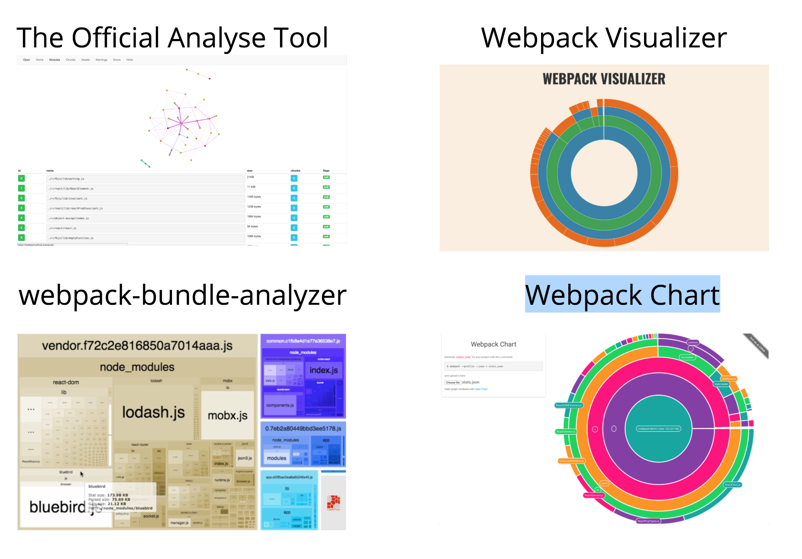

# webpack 优化


## webpack 性能分析工具



- 官方分析工具

[http://webpack.github.io/analyse/](http://webpack.github.io/analyse/)

```bash
 # 生成性能分析文件 stats.json
 webpack --profile --json > stats.json
 ```

 - Webpack Visualizer

[http://chrisbateman.github.io/webpack-visualizer/](http://chrisbateman.github.io/webpack-visualizer/)

 可视化查看每个模块的大小


- webpack-bundle-analyzer

分析bundle体积的组成. 找到占体积比较大的部分.

[https://www.npmjs.com/package/webpack-bundle-analyzer](https://www.npmjs.com/package/webpack-bundle-analyzer)

- Webpack Chart

也是用来分析每个模块的体积. 

[https://alexkuz.github.io/webpack-chart/](https://alexkuz.github.io/webpack-chart/)

## 提高webpack构建速度

### 1. 库文件外链

将用到的库文件通过外链的形式引入. 避免将其打包到业务代码中. 同时可以减少打包后的bundle体积

通过配置的external参数来设置. 

[https://doc.webpack-china.org/configuration/externals/](https://doc.webpack-china.org/configuration/externals/)

防止将某些 import 的包(package)打包到 bundle 中，而是在运行时(runtime)再去从外部获取这些扩展依赖(external dependencies)。

```html
<!-- 引用cdn的库 -->
<script src="https://code.jquery.com/jquery-3.1.0.js"></script>

```

```json
// webpack config 配置

externals: ["react", /^@angular\//]

```

```JavaScript

// 使用

import $ from 'jquery';

$('.my-element').animate(...);

```


### 2. 动态链接库(dll)

[https://webpack.js.org/plugins/dll-plugin/#components/sidebar/sidebar.jsx](https://webpack.js.org/plugins/dll-plugin/#components/sidebar/sidebar.jsx)

用到的node_modules中的库文件变更比较小, 如果每次构建的时候都构建打包一次会耗时比较多. 因此可以将用到的库文件提取出来, 打包为一个dll文件, 作为前置依赖在页面上引入. 这样在每次构建的时候只需要构建业务代码即可. 可以极大的提高构建的速度. 

dll方式与external的区别. external 适合提供构建好的production文件的如vue, react等. 但是npm包中仍然有许多是没有生产包的. 或者对于只引用npm包中的部分内容的情况如(require('react/lib/react')), external就做不到了. 


要使用dll方式需要2个步骤. 1. 构建生成dll文件. 2. 在业务代码的构建中引入dll文件的mainfest.json. 

#### 生成dll文件的webpack配置

先构建出dll文件, 会生成2个文件, dll.js 和 mainfest.json. 

其中mainfest.json中包含每个模块的id. 在业务代码的bundle中, 通过该id引入相应的dll中的模块. 

每次包文件的升级变更都需要重新执行dll构建

```JavaScript

const path = require('path');
const webpack = require('webpack');

module.exports = {
  entry: {
    vendor: ['react', 'react-dom']
  },
  output: {
    path: path.join(__dirname, 'dist'),
    filename: '[name].dll.js',
    /**
     * output.library
     * 将会定义为 window.${output.library}
     * 在这次的例子中，将会定义为`window.vendor_library`
     */
    library: '[name]_library'
  },
  plugins: [
    new webpack.DllPlugin({
      /**
       * path
       * 定义 manifest 文件生成的位置
       * [name]的部分由entry的名字替换
       */
      path: path.join(__dirname, 'dist', '[name]-manifest.json'),
      /**
       * name
       * dll bundle 输出到那个全局变量上
       * 和 output.library 一样即可。 
       */
      name: '[name]_library'
    })
  ]
};

```

生成的mainfest.json如下


```json

// cat dist/vendor-manifest.json
{
  "name": "commonVendor_0ee12a1211e159ba4081",
  "content": {
    "../node_modules/core-js/modules/_export.js": {
      "id": 0,
      "meta": {}
    },
    "../node_modules/core-js/modules/_global.js": {
      "id": 2,
      "meta": {}
    },
    "../node_modules/core-js/modules/_fails.js": {
      "id": 3,
      "meta": {}
    },
// ...
}


```

#### 业务代码的构建中使用dll

```JavaScript


const path = require('path');
const webpack = require('webpack');

module.exports = {
  entry: {
    'dll-user': ['./index.js']
  },
  output: {
    path: path.join(__dirname, 'dist'),
    filename: '[name].bundle.js'
  },
  // ----在这里追加----
  plugins: [
    new webpack.DllReferencePlugin({
      context: __dirname,
      /**
       * 在这里引入 manifest 文件
       */
      manifest: require('./dist/vendor-manifest.json')
    })
  ]
  // ----在这里追加----
};


```

### 3. 减少构建搜索或者编译路径

[https://webpack.js.org/configuration/resolve/](https://webpack.js.org/configuration/resolve/)


```json

resolve: {
    alias: {
        // 通过给引用的模块的路径设置alias别名, 可以减少路径的解析
        'src': path.resolve(__dirname, '../src'),
        'assets': path.resolve(__dirname, '../src/assets'),
        'components': path.resolve(__dirname, '../src/components')
    }
}

// 在引用 ~/git/project/src/app/header/index.js 时可以直接 require('src/app/header/index.js')

```

使用exclude编译的项目

```json

{
    test: /\.js$/,
    exclude: /node_modules/,
    loaders: [ 'happypack/loader?id=js']
}

```

### 4. 并行, 缓存

通过使用happypack来调用多进程构建. 

[happypack](https://github.com/amireh/happypack)

```javascript

exports.plugins = [
  new HappyPack({
    id: 'jsx',
    threads: 4,
    loaders: [ 'babel-loader' ]
  }),

  new HappyPack({
    id: 'coffeescripts',
    threads: 2,
    loaders: [ 'coffee-loader' ]
  })
];

exports.module.loaders = [
  {
    test: /\.js$/,
    loaders: [ 'happypack/loader?id=jsx' ]
  },

  {
    test: /\.coffee$/,
    loaders: [ 'happypack/loader?id=coffeescripts' ]
  },
]

```

无论在何种性能优化中，缓存总是必不可少的一部分，毕竟每次变动都只影响很小的一部分，如果能够缓存住那些没有变动的部分，直接拿来使用，自然会事半功倍，在 webpack 的整个构建过程中，有多个地方提供了缓存的机会，如果我们打开了这些缓存，会大大加速我们的构建，尤其是 rebuild 的效率。

1. webpack.cache

rebuild +
webpack 自身就有 cache 的配置，并且在 watch 模式下自动开启，虽然效果不是最明显的，但却对所有的 module 都有效。

2. babel-loader.cacheDirectory

rebuild ++
babel-loader 可以利用系统的临时文件夹缓存经过 babel 处理好的模块，对于 rebuild js 有着非常大的性能提升。

3. HappyPack.cache

build +, rebuild +
上面提到的 happyPack 插件也同样提供了 cache 功能，默认是以 .happypack/cache--[id].json 的路径进行缓存。因为是缓存在当前目录下，所以他也可以辅助下次 build 时的效率。


## 参考资料:

1. [https://juejin.im/entry/5769f8dc128fe10057d2f4ae](https://juejin.im/entry/5769f8dc128fe10057d2f4ae)
2. [http://slides.com/hilaryzhu/webpack#/3](http://slides.com/hilaryzhu/webpack#/3)

