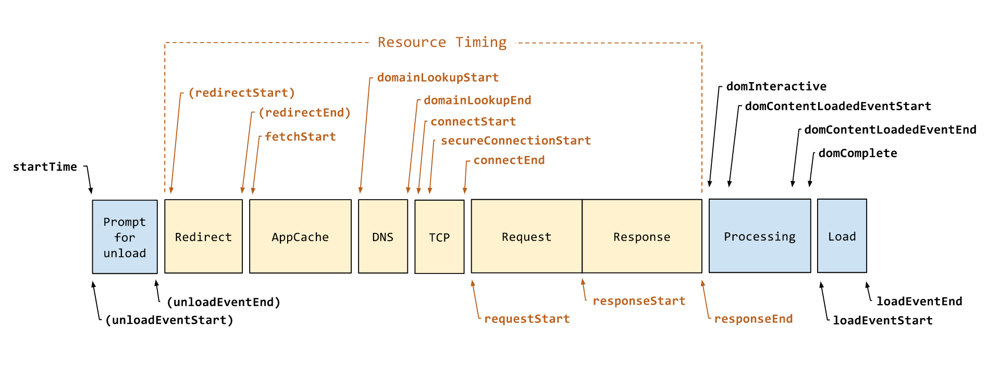
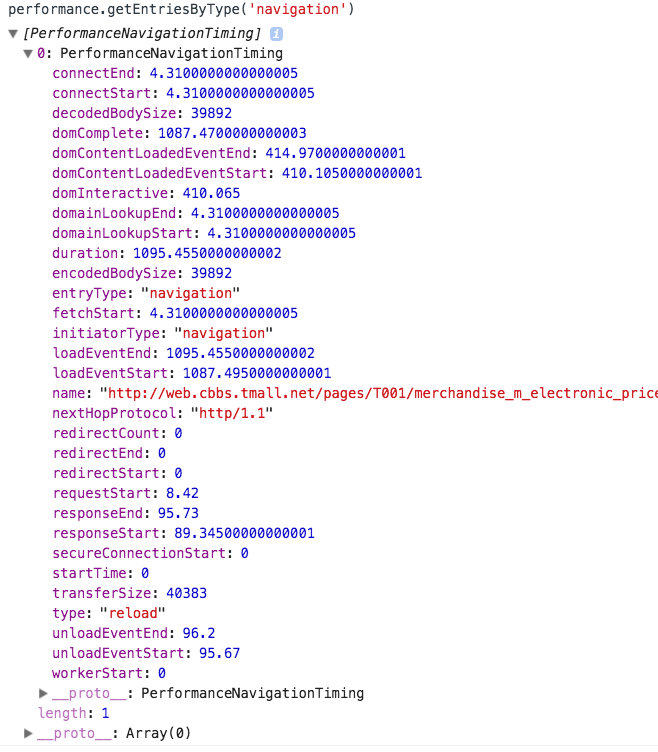
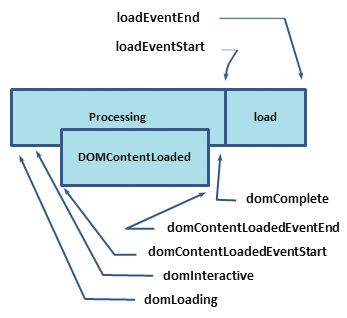
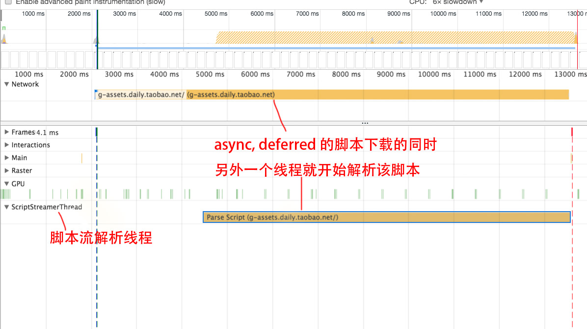
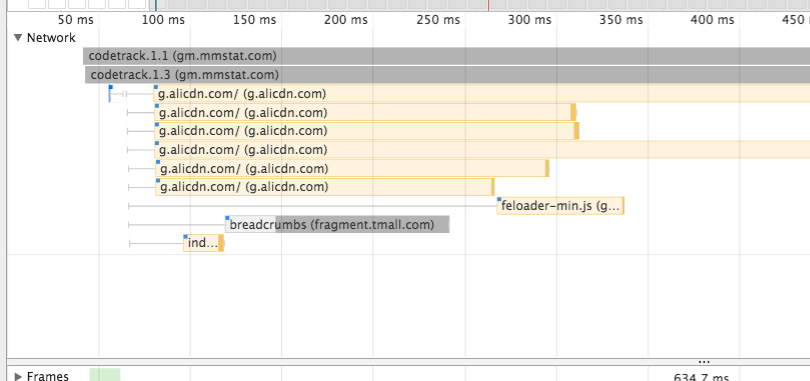
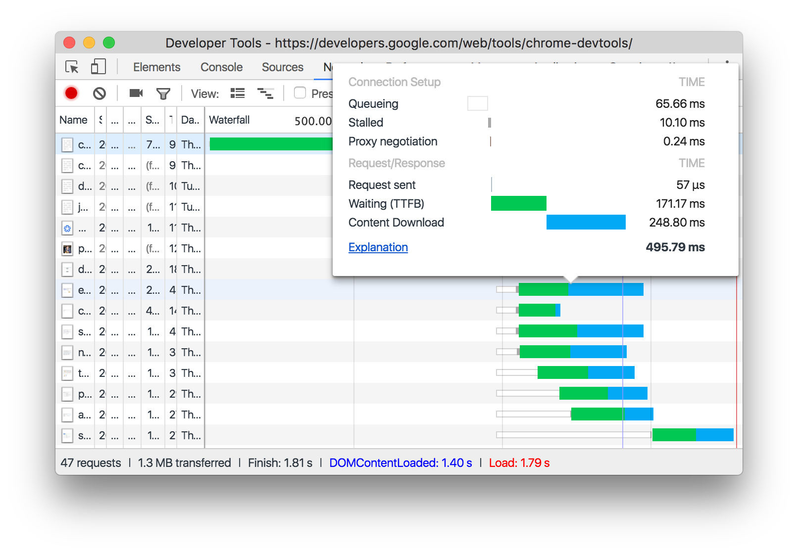
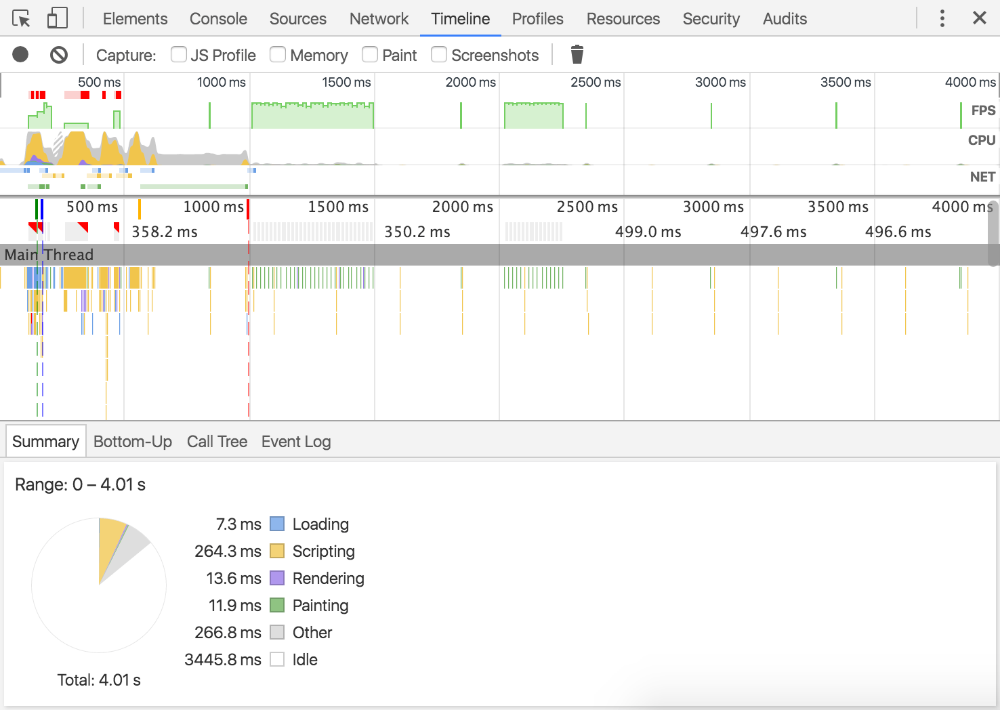
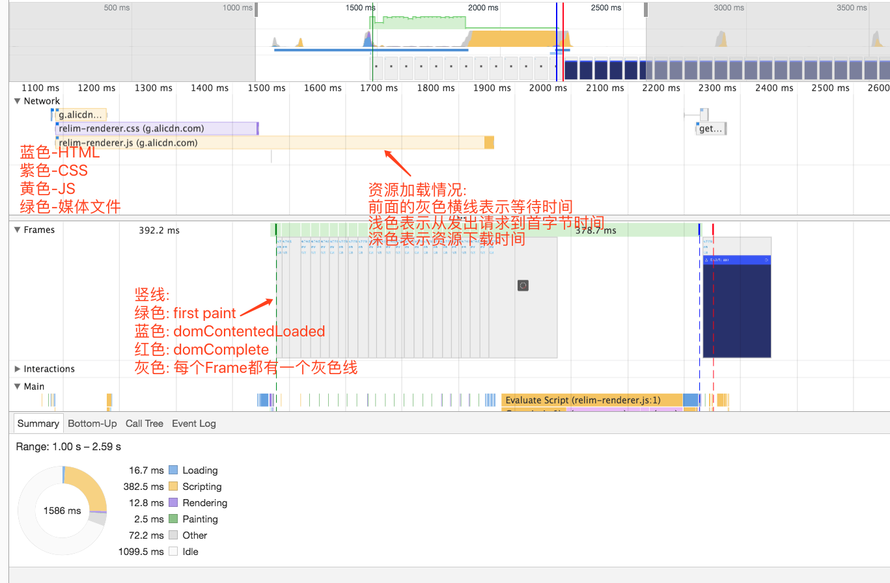

# web 优化

## 浏览器关键时间点 

[https://www.w3.org/TR/navigation-timing-2/#performanceentry](https://www.w3.org/TR/navigation-timing-2/#performanceentry)




网页加载时间节点

- TTFB: First Byte 首字节
- TTDD: time to document download. 从服务器加载HTML文档的时间
- TTHE: time to head end. HTML文档头部解析完成的时间
- TTSR: time to start render. ：白屏时间, 浏览器开始渲染的时间，从用户角度出发则可以定义为用户在页面上看到的第一个内容的时间。 即TTSR越短，用户越早浏览器中的内容，心理上的等待时间会越短。
- Start Render，First Paint 开始渲染，白屏时间
- DOMContentLoaded 网页结构加载解析成DOM
- Load 网页加载完成，包括样式图片iframe等加载

## performance属性 获取性能数据

```
performance.getEntriesByType('navigation') // 获取页面性能参数

```



- performance.getEntries() 获取页面各个资源的加载性能, navigation性能以及Paint性能.
- performance.getEntriesByType('navigation') 主要的性能在该类型中保存


## performance数据记录过程

[https://www.w3.org/TR/navigation-timing-2/#performanceentry](https://www.w3.org/TR/navigation-timing-2/#performanceentry)

1. startTime: 设置 startTime = 0
2. unloadEventStart: 上个页面unload. 如果不是同域名的页面, unloadEventStart和unloadEventEnd的时间会设置为0
3. unloadEventEnd: 上个页面unload
4. workerStart: 如果该url已经注册了worker, 在运行worker之前, 此时会记录workerStart时间
5. fetchStart: 在发出HTTP GET请求之前记录fetchStart时间, 或者是匹配到缓存读取缓存之前
6. 把 domainLookupStart, domainLookupEnd, connectStart and connectEnd 的值设置为与 fetchStart 相同.
7. name: 把当前的url地址设为name属性
8. 如果是读取的缓存, 或本地资源,则跳到  request-start-step.
9. domainLookupStart: 如果需要查询域名, 进行域名解析, 并记录时间为 domainLookupStart, 否则跳到connect-start-step
10. domainLookupEnd: 在domain解析完成之后记录时间为domainLookupEnd.
11. [connect-start-step]: 如果建立了长连接, 则设置 connectStart 和 connectEnd 与domainLookupEnd的值相同. 否则在初始化建立连接时记录时间为connectStart, 于server建立连接之后记录为connectEnd. 在连接建立之后设置 nextHopProtocol的值为当前的http的协议(如 http/1.1).
12. [request-start-step]: 客户端在发送请求之前设置 requestStart时间
13. responseStart: 在客户端收到response的第一个字节时记录
14. responseEnd: 收到response的最后一个字节时
15. domInteractive: Record the time as domInteractive immediately before the user agent sets the current document readiness to "interactive".
16. domContentLoadedEventStart: 
17. domContentLoadedEventEnd
18. domComplete 
19. loadEventStart
20. loadEventEnd
21. Set the duration to a DOMHighResTimeStamp equal to the difference between loadEventEnd and startTime, respectively.


## 首字节等关键时间点概念

### 首字节 TTFB (Time To First Byte)

从最开始的客户端向服务端发出请求到接受到服务端返回的第一个字节的时间.这个第一个字节不是内容, 而是http头的第一个字节

该指标反应了网络的情况. 

该时间包括dns解析 + socket连接 + 服务器处理请求并响应的时间.

优化角度:
- 优化dns解析
- cdn

### 文档加载 TTDD (Time To Document Download)

从服务器加载HTML文档时间

### 文档解析 TTHE (Time To Head End)

HTML文档头部解析完成所需要的时间.

### 开始渲染时间. 白屏时间 TTSR (Time To Start Render)

浏览器开始渲染的时间, 用户看到第一个内容的时间. 

TTSR 时间越短, 用户越早看到浏览器中的内容

TTSR = TTFB + TTDD + TTHE;

** 影响因素 **

- 服务器响应时间
- HTML文档大小
- HTML的HEAD中资源使用情况, 是否有脚本阻塞页面的解析. html head 中如果有脚本, 会阻塞页面, 只有其前面的资源如css等全部加载完成自身才会解析. 如果头部必须有脚本, 可以把脚本放在head最前面, 后面放css文件.

** 与Dom相关的事件 **



通过 window.performance.getEntries(PerformanceEntryFilterOptions); 可以获取性能指标.

- domLoading: 整个过程开始的时间戳, 浏览器开始解析HTML文档第一批收到的字节document
- domInteractive: 可以交互, 浏览器完成解析并且所有HTML 和 DOM 构建完毕的时间点.
- domContentLoaded: 标记 DOM 准备就绪并且没有样式表阻碍 JS执行的时间点 - 意味着我们可以开始构建呈现树了。 此时一些图片资源可能还没有下载完成, 此事件在domComplete之前完成.
  - 很多 JavaScript 框架等待此事件发生后，才开始执行它们自己的逻辑。因此，浏览器会通过捕获 EventStart 和 EventEnd 时间戳，跟踪执行逻辑所需的时间。
- domComplete: 所有资源下载完成,包括css, image等资源. 也即加载旋转图标停止旋转.
- loadEvent: 网页加载的最后一步, 会触发onLoad事件. 

DomContentLoaded 通常标记 [DOM 和 CSSOM 都准备就绪] 的时间 , 通俗的讲就是：页面解析完成的时间，在高级浏览器里有对应的DOM事件 - DOMContentLoaded，Firefox官方的解析如下：

Fired at the page’s Document object when parsing of the document is finished. By the time this event fires, the page’s DOM is ready, but the referenced stylesheets, images, and subframesmay not be done loading; use the “load” event to detect a fully-loaded page.

TTSR指标直接决定着用户对页面速度的体验，与此不同，DOM Ready指标并不直接影响感官体验，往往影响的是交互功能何时可用。为何影响的是交互呢？由于DOMContentLoaded事件触发时是所有DOM节点可以进行操作的时候，比如添加事件、增删改节点等，因此用Javascript实现的一些交互功能往往会在DOMContentLoaded事件中去初始化，也只有在DOMContentLoaded事件触发后这项功能才可用。

这里还要提及的是 DomContentLoaded , DomComplete 这两个时间的差别，网页的Dom内容加载并解析完成时会触发DomContentLoaded，而DomComplete是在网页的资源（css,image等）加载完成后才触发。英文文档原文如下：

The DOMContentLoaded event is fired when all of the page’s DOM content has been loaded and parsed. The load event is fired once all of the document’s resources (images and CSS files, and so forth) have been fully loaded.

### TTDR (Time To Dom Ready)

TTDR = TTSR + TTDC + TTST;

- TTSR: Time to start render. 浏览器开始渲染的时间
- TTDC: time to dom created. dom树创建所消耗时间
- TTS: time to script. BODY中所有脚本加载和执行的时间.

TTDR 主要受以下因素影响.
1. DOM结构的复杂度
2. js脚本的运行时间.

通过对一些实际监控数据的分析得出，在一个通过正常方式加载脚本的页面中，脚本的加载和执行时间往往能占DOM Ready时间的50%左右，由此可见脚本的使用对DOM Ready指标的影响如何的显著！因此，对DOM Ready指标的优化也应该着重从js脚本的使用入手。
当然，随着硬件性能越来越高，脚本的执行时间对于页面加载速度的影响会越来越少；但是，如果有构建一个60fps的web应用，细节往往是非常重要的

### TTI(Time To Interact) 可交互时间

TTI(Time To Interact)指的是页面可交互的时间。页面中的交互包括很多方面，例如点击一个链接、点击一个搜索按钮都属于页面交互的范畴，但是对于衡量性能的TTI则主要指核心功能可以交互的时间。核心功能的定义则是随着页面的不同而不同，例如对于百度首页而言，最为关键的就是搜索框出现的时间、而对于一些购物网站的商品详情页最关键的是购买功能可用和描述出现的时间。而目前的实际情况，TTI大都等于DOM Ready时间，因为不论交互功能是否重要，相关的Javascript都会在DOM Ready后才进行初始化和绑定，而实际上TTI是可以更早的。

通过TTI的定义可以知道，TTI的长短对于用户体验的影响是十分重要的，它影响着用户对核心功能的使用。

影响因素

- start render. 只有内容开始渲染了, 接下来才能开始交互.
- 核心功能HTML元素的显示时间, 决定着核心功能对用户可见的时间.
- 提供用户交互的JS脚本什么时候执行完成 ， 决定着核心Javascript功能可交互的时间

在HTML5应用中，JS模板引擎的使用是非常普遍的，这个使用得好可以提高TTI时间，使用得不好，会比没有使用模板引擎而是通过后端模板引擎渲染的页面更慢。客户端使用JS模板引擎进行渲染的过程必须知会用户，让用户不至于见到一个空白页面，


## HTML文档的解析


#### 脚本解析
遇到script会进行脚本解析, 并阻塞后续文档的解析, 如果是外引的, 需要先加载再解析, 也是同步的.

对于动态插入页面的脚本，先返回的脚本先执行。
如通过 appendChild() 依次插入到页面3个脚本分别为 a.js, b.js, c.js。 其执行顺序按照脚本下载完成的顺序执行。先返回数据的先执行。 

#### 预解析
新的浏览器做了优化, 在脚本解析时会开启另一个线程解析剩余的文档, 主要是解析出需要网络加载的资源, 进行加载. 以提高整体速度. 

#### css
由于js中可能会需要依赖css的计算结果, 因此需要等css脚本之后如果有js脚本, 则此时会阻塞HTML剩余部分的解析, 需要css解析完成之后再解析js脚本及后续的部门.

Firefox在存在样式表还在加载和解析时阻塞所有的脚本，而Chrome只在当脚本试图访问某些可能被未加载的样式表所影响的特定的样式属性时才阻塞这些脚本


## 预加载解析

### preRender

[https://www.chromium.org/developers/design-documents/prerender](https://www.chromium.org/developers/design-documents/prerender)

[w3c prerender标准](https://www.w3.org/TR/resource-hints/#prerender)

```

<link rel="prerender">

```

#### 机制


## 渲染性能

[https://developers.google.com/web/fundamentals/performance/rendering/](https://developers.google.com/web/fundamentals/performance/rendering/)


## 其他资料

#### chrome脚本解析加速

参考 https://blog.chromium.org/2015/03/new-javascript-techniques-for-rapid.html

- 原来的js的下载解析在一个线程中, 是同步的, 
chrome41开始在js下载的同时会利用其他线程进行js的解析, 因此在js下载完成之后很快就会完成js解析.
- code caching. 之前每次刷新页面v8引擎都会解析该页面的js脚本, 离开页面时会丢弃解析的数据. 

### 脚本异步执行方法

```
<script type="text/javascript" src="demo_async.js" async="async"></script>
```

async 属性规定一旦脚本可用，则会异步执行。

注释：async 属性仅适用于外部脚本（只有在使用 src 属性时）。

注释：有多种执行外部脚本的方法：

如果 async="async"：脚本相对于页面的其余部分异步地执行（当页面继续进行解析时，脚本将被执行）
如果不使用 async 且 defer="defer"：脚本将在页面完成解析时执行
如果既不使用 async 也不使用 defer：在浏览器继续解析页面之前，立即读取并执行脚本

对于async和deferred的scripts, chrome会开启一个独立的线程在脚本下载的同时来解析脚本. 因此脚本一旦下载完成, 迅速就回被解析完毕.



参考[https://blog.chromium.org/2015/03/new-javascript-techniques-for-rapid.html](https://blog.chromium.org/2015/03/new-javascript-techniques-for-rapid.html)

## JS混淆对性能影响

原文: [前端优化系列 - JS混淆引入性能天坑](http://blog.csdn.net/yunqishequ1/article/details/78873668)

js混淆通常有正则替换及抽象语法树修改两种方式, 在语法树修改的过程中会引入多余的代码, 有时候会引入性能问题. 


## 用到的工具

### js加载测试



由图可以看出, js可以并行加载, 不过由于HTTP请求数的限制, 同个域名最多只能并行6个请求, 超出会延后下载.
但是js的执行会阻塞. 由于js可能会修改HTML或样式, 或者需要获取样式中的值如(var width = $('.box').width), 此时如果在样式渲染完成前js先执行,会导致无法获得准确的值. 

在解析HTML过程中遇到脚本, 主进程会解析当前脚本并阻塞后续的解析, 同时会开启另外一个线程预解析后面的文档, 并加载需要加载的网络资源, 以此提高解析速度. 与解析不会改变Dom树, 这个工作会留给主解析过程, 自己只解析外部资源的引用, 如外部脚本, 样式表及图片资源. 


###  NetWork面板

 [chrome devtools network面板分析](https://developers.google.com/web/tools/chrome-devtools/network-performance/reference)

 chrome network面板 Timing 字段 解释



1.1 Queueing: 请求在队列中的等待时间. 有3种情况. 1. 如果有更高优先级的请求, 2. 该域的TCP链接超过6个(HTTP/1.0, HTTP/1.1的限制), 3. 浏览器正在分配缓存空间

1.2 Stalled: 队列中等待时的那些原因导致的请求被暂停的时间

1.3 DNS Lookup: DNS解析时间

1.4 Proxy negotiation: 请求转发代理, 与代理服务器连接所用时间

1.5 Request sent: 请求发送

1.6 ServiceWorker Preparation: 浏览器启动worker

1.7 Request to ServiceWorker: 请求被发送到worker

1.8 Waiting (TTFB): 首字节返回时间

1.9 Content Download: 收到请求下载数据的时间

1.10 Receiving Push: 通过HTTP/2 Push 获取数据

1.11 Reading Push: 读取上一步获取的数据

### 资源加载图标含义

[了解 Resource Timing](https://developers.google.com/web/tools/chrome-devtools/network-performance/understanding-resource-timing)

### Chrome Timeline面板解析

[chrome timeline 面板解析](https://developers.google.com/web/tools/chrome-devtools/evaluate-performance/timeline-tool)



包括四部分

1. 控制区: 
2. Overview: 页面性能的汇总.
3. 火焰图: CPU堆叠情况的可视化. 火焰图上有3条垂直的虚线. 绿色是 FirstPaint时间, 蓝色是 DomContentedLoaded事件,  红色是 onLoad事件.
4. details: 选择事件时显示该事件的信息, 未选择时显示选定时间范围的相关信息.


#### Overview 部分

包括以下三个图表内容

1. FPS。每秒帧数。绿色竖线越高，FPS 越高。 FPS 图表上的红色块表示长时间帧，很可能会出现卡顿。
2. CPU。 CPU 资源。此面积图指示消耗 CPU 资源的事件类型。
3. NET。每条彩色横杠表示一种资源。横杠越长，检索资源所需的时间越长。 每个横杠的头部的灰色线表示从队列等待到发出请求的时间, 浅色部分表示等待时间（从请求发出到第一个字节下载完成的时间)。 深色部分以及尾部的灰色线表示文件传输时间(即从TTFB到finish load). 
4. NET面板中 HTML 文件的深蓝色部分表示发出请求到首字节时间, 后面的灰色的线表示从TTFB到HTML文件finish load的时间. 

net图表横杠的色彩含义

- HTML为蓝色
- js脚本为黄色
- css文件为紫色
- 媒体文件为绿色
- 其他资源为灰色





### chrome performance 面板字段解释

(chrome performance 面板详细解释)[https://developers.google.com/web/tools/chrome-devtools/evaluate-performance/reference]

### chrome Trace

使用说明: [https://www.chromium.org/developers/how-tos/trace-event-profiling-tool/recording-tracing-runs]

### 谷歌官方 PageSpeed Insights 

谷歌官方 网站性能测试工具

[PageSpeed Insights](https://developers.google.com/speed/pagespeed/insights/?)


### 参考资料

- [浏览器关键时间点](http://zhangmhao.github.io/2014/05/20/%E6%B5%8F%E8%A7%88%E5%99%A8%E5%85%B3%E9%94%AE%E6%97%B6%E9%97%B4%E7%82%B9/)


- [chrome js脚本解析加速改进](https://blog.chromium.org/2015/03/new-javascript-techniques-for-rapid.html)


- [避免大型、复杂的布局和布局抖动](https://developers.google.com/web/fundamentals/performance/rendering/avoid-large-complex-layouts-and-layout-thrashing)

- [高性能网络](https://www.igvita.com/posa/high`-performance-networking-in-google-chrome/) 讨论了 Chrome 网络内部机制，以及您如何充分利用它们让您的网站更快。

- [gzip 压缩的工作原理](https://developers.google.com/speed/articles/gzip)提供了 gzip 压缩的高级概览，并介绍了这种压缩为什么是一种不错的方法。

- [网页性能最佳做法](https://developers.google.com/speed/docs/best-practices/rules_intro)提供了更多用于优化您的网页或应用的网络性能的提示。

- [chrome resource Timing各阶段解析](https://developers.google.com/web/tools/chrome-devtools/network-performance/understanding-resource-timing)

- [对于async deferred的js脚本用多线程解析js脚本](https://blog.chromium.org/2015/03/new-javascript-techniques-for-rapid.html)

- [谷歌使用 RAIL 模型评估性能](https://developers.google.com/web/fundamentals/performance/rail)

- [谷歌官方浏览器渲染性能](https://developers.google.com/web/fundamentals/performance/rendering/)


