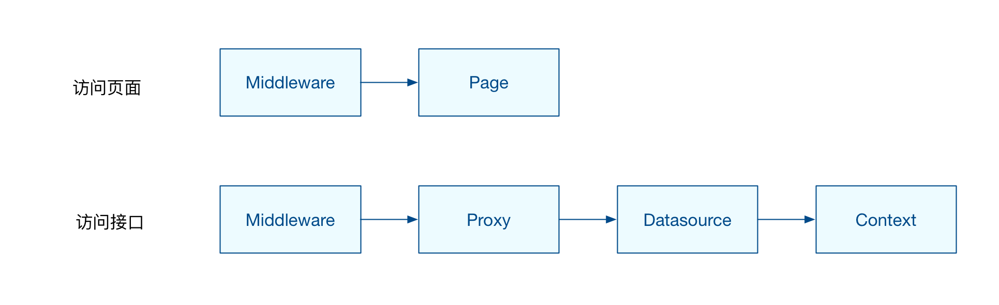

# 项目架构

## 天蝎移动

参考架构 [前端工程化开发方案app-proto](http://tech.meituan.com/tech-salon-13-app-proto.html)

技术栈 
- 服务端: webpack + node + koa + react
- 视图层: vue

### 目录结构

项目目录结构

```bash

~]# tree -I node_m** -L 2 

├── README.md
├── bootstrap
│   ├── development.js
│   └── production.js
├── castle.json
├── deployment
│   ├── common.d
│   ├── common.sh
│   ├── ops-build -> runrun
│   ├── ops-build.d
│   ├── run-at-cloud -> runrun
│   ├── run-at-cloud.d
│   └── runrun
├── hooks
│   └── pre-commit
├── index.js
├── logs
│   └── ia-fe-icrm
├── package.json
├── server
│   ├── config
│   ├── contexts
│   ├── core
│   ├── datasources
│   ├── index.js
│   ├── main.js
│   ├── middlewares
│   ├── pages
│   ├── proxies
│   ├── templates
│   └── utils
├── src
│   ├── actions
│   ├── adapters
│   ├── api
│   ├── app.vue
│   ├── assets
│   ├── components
│   ├── constants
│   ├── decorators
│   ├── emitter.js
│   ├── filters
│   ├── interceptors
│   ├── menus.js
│   ├── mixins
│   ├── monitor
│   ├── mutations
│   ├── pages
│   ├── routes.js
│   ├── store
│   ├── style
│   └── utils
├── support
│   ├── ia-only-files
│   └── plus
├── webpack
│   ├── assets.json
│   ├── src.config.js
│   ├── src.development.config.js
│   └── src.production.config.js
└── webroot
    ├── assets
    └── manifest.json

```

server - node 服务层，主要进行 API 的转发
config - node 服务层的配置
consts - 常量
contexts - koa 上下文环境，参见 app-proto
core - 运维监控等方法
datasources - API 转发，参见 app-proto
middlewares - koa 中间件
pages
index.js - 单页面路口
templates - 页面模板，参见 app-proto
utils - 帮助方法
client - 前端页面
actions - redux actions
common - 公共 actions
pages - 页面的 actions
shares - 公共业务组件的 action
commons - 公共业务及通用方法
components - react 组件
pages - 页面组件
shares - 公共业务组件
common - 通用的业务或基础组件
consts - 常量
action-type.js - redux action type，也是整个应用 action type 存在的地方
state-point.js - 可访问路由及页面和公共业务组件根 state key
menu.js - 整个应用菜单
business - 业务常量
containers - 与 redux connect 的 container component
pages - 页面 container
shares - 公共业务组件 container
core
datasources - DS 请求中间件
formatter - 数据格式化方法
framework - 常用功能及数据流转的封装
ui - 基础 React 组件
utils - 帮助方法
validators - 常用验证器
entry.js - 单页面路由
pages - 页面入口，参见 app-proto
reducers - 应用 redux reducer
routes - 路由配置
style - 样式



### 启动流程 Bootstrap


（1）工程默认入口文件index.js，使用 npm init 默认创建package.json文件，在该文件scripts中添加start字段，如下：

```json
{
    ...
    "scripts" : {
        "start": "node ./index.js",
    },
    ...
}

```

这样在终端只要输入以下命令即可启动应用了

```bash
$ npm start
```

(2）访问主模块

当Node.js直接运行一个文件时，require.main会被设为它的module。这意味着你可以通过如下代码直接确定文件是否已运行：

```
require.main === module
```

对于index.js文件，如果通过 node  index.js 运行则为true，但如果通过 require('./index.js') 运行则为false。
因为module提供了一个filename属性（通常等于__filename），所以可以通过检查 require.main.filename 来获取当前应用程序的入口点。

（3）查找文件

使用node的fs模块的accessSync函数或者existsSync函数，exists()函数已经弃用。

- accessSync函数：如果有任何可访问性检查失败则抛出错误，否则什么都不做！
- existsSync函数：如果文件存在，则返回true，否则返回false。

```javascript

function accessible(filePath) {
    let fs = require('fs');
    try {
        fs.accessSync(filePath);
        return true;
    } catch(e) {
        return e;
    }
}

```

（4）nodemon监听服务

在开发阶段，我们往往需要一个监听工具，当我们应用程序改变的时候，自动重启项目工程。这个工具有很多，比如：forever、supervisor、nodemon、node-dev，这里选用nodemon因为它配置比较方便，文档比较清晰。

使用nodemon代替node来启动应用

```bash
$ nodemon app.js // => node app.js
```

Events：nodemon总共有五个状态
start：子进程（即监控的应用）启动
crash：子进程奔溃，不会触发exit
exit：子进程完全退出，不是非正常的奔溃
restart：子进程重启
config:update：nodemon的config文件改变
Watch：监控的文件夹路径或者文件路径，支持正则表达式
Ignore：忽略的文件后缀名或者文件夹

（5）Koa启动服务

使用Koa创建一个node服务，开发时使用koa-static中间件设置静态文件服务器

```javascript

var koa = require('koa');var app = new koa();
var serve = require('koa-static');   
app.use(serve('root'[, opts]));

```

总结：
创建项目需要有node的知识，以及使用过node相关的开发工具。