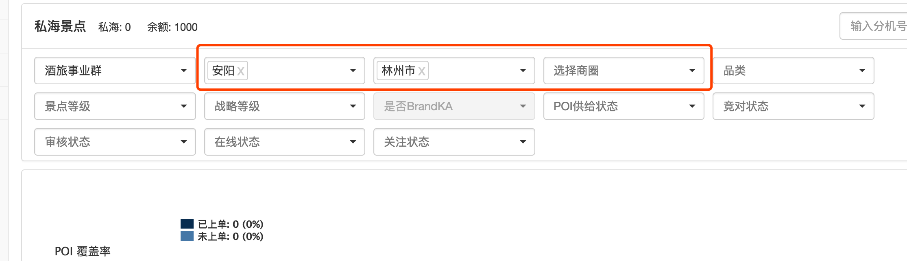

[TOC]

# 多个相互联动组件封装思路

如选择省, 市, 县, 区域, 商圈的多级联动组件.

选择了前一个, 后面一个才会有数据. 后面的数据依赖前面的选择.

有的地方需要使用全部筛选项, 有的只使用部分筛选项.



### 特点

- 多组件: 由多个组件组成, 样式独立, 不适合整体封装.
- 灵活性: 可能会有多种使用方式, 如有的模块需要使用全部相关联动组件, 有的模块只需要使用部分组件.
- 联动性: 功能相关, 操作相互联动, 数据相互依赖. 整体封装会更方便使用.

### 封装思路

1. 整体封装
2. 独立封装
3. 样式独立, 只对数据操作整体封装.

### 整体封装, 对外暴露样式修改接口

将多个联动的组件整体封装, 对外暴露 class, style接口, 可以通过在使用时添加类名或样式来适配样式.

```html
<!-- 如下调用, 提供样式或类的接口来适配不同场景的样式. -->

<linkage-compoennt styles="{province: {}, city: {}}" classes="{province: [], city: []}" city-id="cityId" on-change="change()"></linkage-compoennt>

```

> 整体封装, 调用管理方便
> 虽然可以通过类或style进行样式调整, 但仍有局限性.

### 独立封装.

将每个组件独立封装, 暴露组件间相交互的数据接口.

```html

<!-- 如下调用, 前一个组件为后一个组件提供数据. -->

<province province-id="provinceId" city-data="cityData" on-change="setCity()"></province> 
<city city-id="cityId" city-data="cityData" area-data="areaData" on-change="setArea()"></city>
<area area-id="cityId" area-data="areaData"></area>

```

> 独立组件, 样式互不影响, 方便在多种场景使用
> 对外暴露了多个用于交互的接口, 在使用时可能会受作用域影响, 同时不方便统一的管理.

### 样式与数据操作分开封装.

样式独立封装. 

相应的数据操作封装到factory中. 在使用时通过调用factory来执行相应的操作. 

```html

<!-- 只封装普通的样式组件, 或者可以用ui-select组件 -->
<province-style province-data="linkageFactory.getProvinceData" on-change="linkageFactory.setCityData()"></province-style> 
<city-style city-data="linkageFactory.cityData" on-change="linkageFactory.setAreaData()"></city-style>
<area-style area-data="linkageFactory.areaData" on-change="linkageFactory.setAreaId()"></area-style>

```

```javascript

// 在factory中封装所用到的方法.
angular.factory('linkageFactory', function () {
    let linkage = {
        getProvinceData () {
            /** **/
            /** **/
            /** **/
        },
        provinceData: [],
        cityData: [],
        cityChange () {
            linkage.setAreaData();
        },
        setCityData () {
            /** **/
            /** **/
            /** **/
        },
        areaData: [],
        areaId: '',
        setAreaData () {
            /** **/
            /** **/
            /** **/
        },
        setAreaId (id) {
			linkage.id = id;
    	}
    };
    return linkage;
});

```

> 将样式与逻辑分开封装自由度更高. 
> 样式自由可以适应任何场合
> 逻辑在factory中也方便管理.
