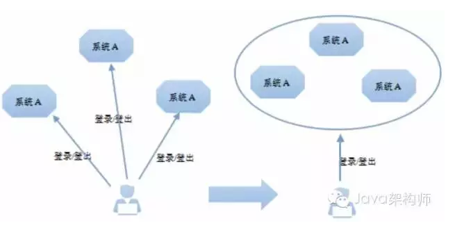
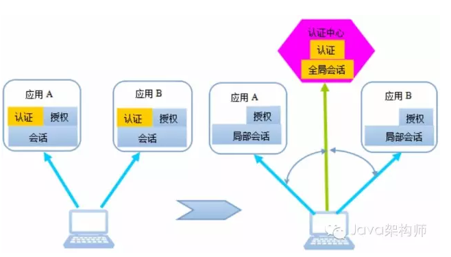
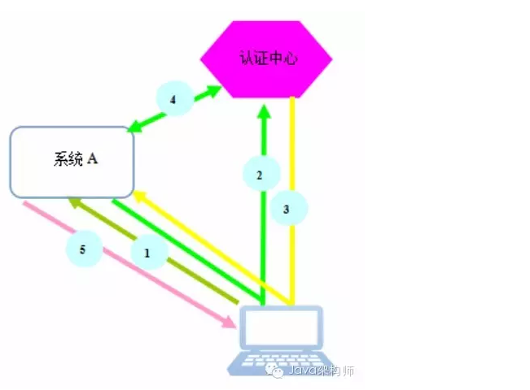
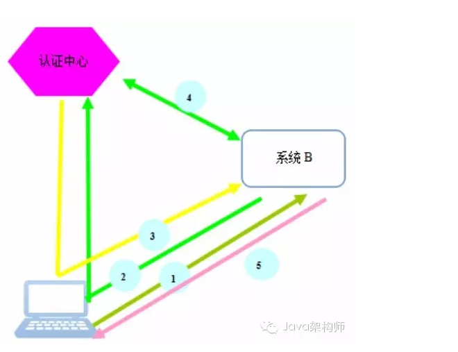
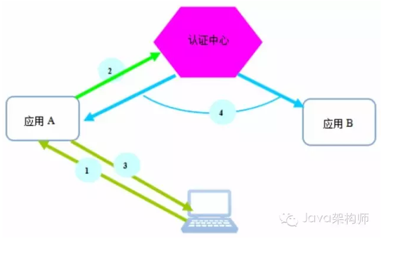

# SSO 与 UPM

## 什么是sso,upm

- sso: signal sign on 用户单点登陆系统
- upm: user permit manage 用户权限管理系统

sso用来为多应用提供一个统一的登陆服务. 这样做的好处就是一处登录，处处通行，用户不需要在各个应用都注册一个账号，也无需输入各类账号密码。

upm用来做用户权限的控制. 权限可以简单理解为用户访问某些url链接的权限(用户所做的操作也是发出固定url的请求). 

## sso

### 什么是 SSO

Web应用系统的演化总是从简单到复杂，从单功能到多功能模块再到多子系统方向发展。当前的大中型Web互联网应用基本都是多系统组成的应用群，由多个web系统协同为用户提供服务。
多系统应用群，必然意味着各系统间既相对独立，又保持着某种联系。
独立，意味着给用户提供一个相对完整的功能服务，比如我们的大象、邮件系统、wiki。
联系，意味着从用户角度看，不管企业提供的服务如何多样化、系列化，在用户看来，仍旧是一个整体，用户体验不能受到影响。
譬如用户的账号管理，用户应该有一个统一账号，不应该让用户在每个子系统分别注册、分别登录、再分别登出。系统的复杂性不应该让用户承担。

在多系统应用群中，这个问题就变得有些复杂，以前本不是问题的问题，现在可能就变成了一个重大技术问题。我们要用技术手段，屏蔽系统底层本身的技术复杂性，给用户提供自然超爽的用户体验。
这就是我们所说的单点登录问题，即SSO(Single Sign On)。
以公司内部的系统为例子：
wiki.site.com
chat.site.com
mail.site.com
这几个系统都有各自的登录入口，每次使用时必须用统一账号登录，但是这些服务对于员工来说都是公司的web服务，相当于一个大系统，所以当登录后从一个系统跳转到另一个系统（如mail到chat）时，不用再重复登录才是良好的用户体验。当用户从其中一个系统退出时，其他系统也一并进行登出操作。如何在后端实现这些流程做到用户无感知，就是SSO的任务了。

### SSO实现难点

1. http是无状态的，保存登录状态要么传递参数要保存cookie。
2. Cookie作用域由属性Domain和Path共同决定的。也就是说，如果浏览器发送的请求不在此Cookie的作用域范围内，请求是不会带上此Cookie的。
不同域名的系统是没办法公用cookie的。
3. 即使服务在同一域名下可以共享cookie，服务端也很难识别属于哪个系统的会话。
4. 异构系统会话实现机制可能不一样，共享会话对原系统入侵很大。

基于以上的问题，业界有一些通用的解决方案，我们目前采用的是 Apereo CAS （https://www.apereo.org/projects/cas） 方案。整个认证流程以 ticket 协议为基础。
CAS是中央认证服务Central Authentication Service的简称。最初由耶鲁大学的Shawn Bayern 开发，后由Jasig社区维护，经过十多年发展，目前已成为影响最大、广泛使用的、基于Java实现的、开源SSO解决方案。
整个认证流程以 CAS 的 ticket 协议为基础。

 
 
 
 
 
用户到认证中心登录后，用户和认证中心之间建立起了会话，我们把这个会话称为全局会话。当用户后续访问系统应用时，我们可以在系统应用和用户浏览器之间建立起局部会话，局部会话保持了客户端与该系统应用的登录状态，局部会话依附于全局会话存在，全局会话消失，局部会话必须消失。
用户访问应用时，首先判断局部会话是否存在，如存在，即认为是登录状态，无需再到认证中心去判断。如不存在，就重定向到认证中心判断全局会话是否存在，如存在，按1提到的方式通知该应用，该应用与客户端就建立起它们之间局部会话，下次请求该应用，就不去认证中心验证了。
  
  

用户在一个系统登出了，访问其它子系统，也应该是登出状态。要想做到这一点，应用除结束本地局部会话外，还应该通知认证中心该用户登出。认证中心接到登出通知，即可结束全局会话，同时需要通知所有已建立局部会话的子系统，将它们的局部会话销毁。这样，用户访问其它应用时，都显示已登出状态。

### SSO 认证流程

  

## upm设计

upm做权限控制的核心是用户，角色，权限这三个模型。比如论坛这种常见的web系统中，游客可以浏览帖子但是不能发帖和回复，登录用户可以发帖可以回复但是不能删除帖子，管理员可以做任何事包括删除帖子，这里面游客，登录用户，管理员是三种不同的角色，每个角色有不同的权限，把角色配置给某个用户之后这个用户就拥有了对应的权限。

使用upm就是完成上面的过程，创建权限（权限和一类url关联），创建角色，给角色配置权限，给用户配置角色

一个upm系统的需要完成的任务即

- 用户: 配置不同角色
- 角色: 包含不同的权限
- 权限: 可以访问的url

应包含的功能有

- 用户管理:
  - 用户角色管理: 授予角色, 取消角色
  - 组织节点角色管理
  - 岗位角色管理
- 角色:
  - 角色列表: 管理员, 访客...
  - 角色管理: 新增, 删除
- 权限
  - 权限列表
  - 权限管理: 新增, 删除权限

