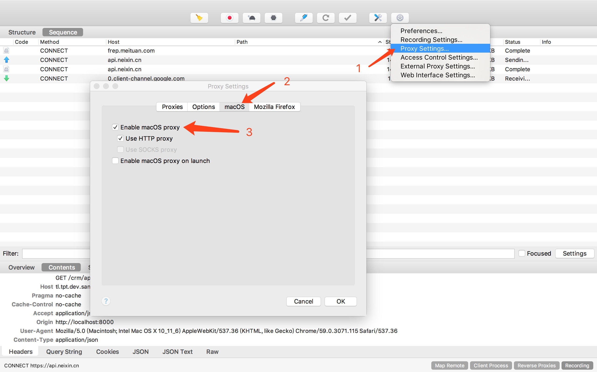
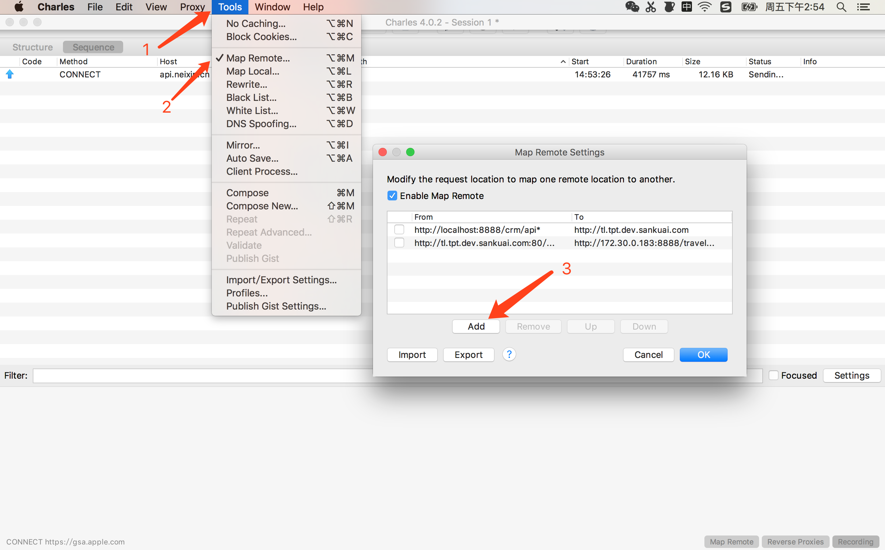
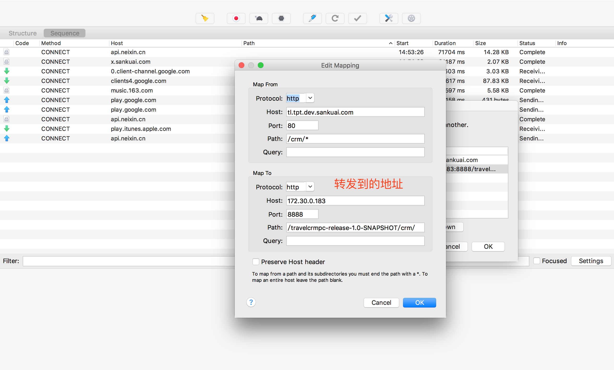
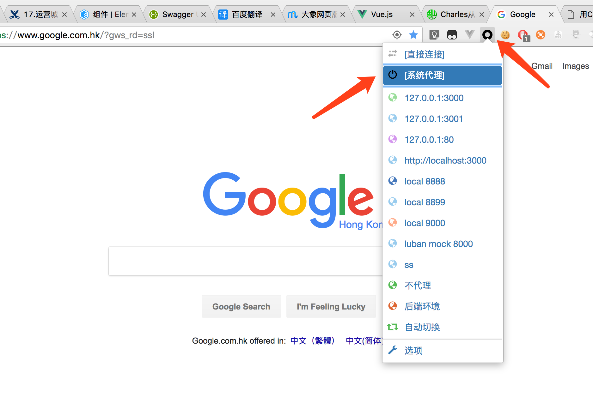

# 用Charles转发请求

当前问题:

1. 由于后端测试环境只有一个, 当有多个需求同时进行的时候, 会遇到测试环境不够用的情况. 
2. 后端发布比较耗时, 
3. 测试环境也不稳定. 

解决方法:

通过用Charles转发请求到后端RD的本地服务, 可以实现前端页面直接连接后端本地服务. 可以解决上述问题

如: 

当前的测试环境请求为 http://tl.tpt.dev.sankuai.com/crm/api/v1/common/getProvinces

后端RD的本地服务地址为 http://172.30.0.183:8888/travelcrmpc-release-1.0-SNAPSHOT/crm/api/v1/common/getProvinces

通过Charles或其他的转发功能对请求进行转发. 

## 配置Charles

如图打开Charles的代理功能

## 配置转发

## chrome配置

chrome默认不走系统代理, 因此Charles无法抓取chrome的请求.

解决方法有3种:

- 1. 在 Chrome 中设置成使用系统的代理服务器设置即可. 

参考[http://jingyan.baidu.com/article/15622f2474b91cfdfcbea501.html](http://jingyan.baidu.com/article/15622f2474b91cfdfcbea501.html)

- 2. 直接将代理服务器设置成 127.0.0.1:8888。

- 3. 通过chrome插件设置代理.

可以使用 [SwitchyOmega](https://chrome.google.com/webstore/detail/proxy-switchyomega/padekgcemlokbadohgkifijomclgjgif?hl=zh-CN) 插件来设置chrome请求走系统代理

