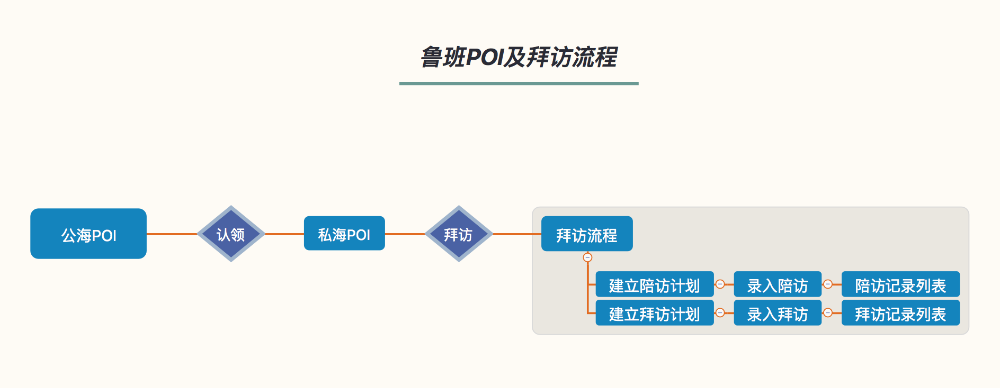

[TOC]

# 鲁班POI拆分动态表格设计方案

### 当前需求特征

#### 旅游需要对POI进行拆分, 

**1. 维度多. 10个维度**

* 将现有POI根据不同的业务线拆分为5个维度. 直签, 	三方, KA团队, 跟团游, 景酒

* 根据POI来源拆分2个维度. 供应商维度, 普通POI维度

**2. 流程一致**

* 每个维度都要实现相同的流程

**鲁班POI及拜访流程**



* 每个流程主要是相关的信息表格和筛选项

| 公海 | 私海 | 拜访计划 | 拜访 | 陪访 | 
| --- |  --- | ---     | ---- | --- |
|  |  |  |  |  | 

**3. 个性化**

不同维度有很多重复的数据及样式, 同时也会有一些个性化的数据. 不能完全复用

## Q: 如何最好的满足多个维度的相似需求, 同时兼顾未来的个性化扩展.

### 可选的前端方案

根据模块拆分的粒度可以选以下方案.

#### 1. 拆分到页面级.

- 每个维度开发一个新的页面.
- 针对每个维度对原有业务代码复制粘贴, 进行适配.

**优势**

> 不同业务不同的页面, 业务最清晰. 

> 方便每个维度自定义样式等设置.

**缺点**

> 极大的增加开发量, 产生大量的冗余代码.

> 开发周期最长, 每个维度的页面都需要联调测试.

> 后续维护. 对于统一的改变需要修改多处, 前后端都需要开发, 对于个性化的修改维护起来比较方便.

#### 2. 拆分到列

- 如公海列表页面, 各个维度都放在一个页面中. 只建立一个公海页面. 
- 对于不同维度的个性化的列都写出来. 每列根据权限的不同来设置显隐.

**优势**

> 开发周期适中

> 对于格式相同的通用列, 如uv, 消费收入等. 可以直接复用. 减轻开发量

> 能满足个性化的需求, 对于个性化的列方便定义设置

> 后续维护: 维护起来也比较方便, 前后端都需要维护.

**缺点**

> 对于不同业务线样式的微小修改也需要配置一个新的列, 会造成业务的冗余

> 随着业务的增加, 列的数量会很多, 会提升代码的复杂度

#### 3. 拆分到单元格

- 以单元格为维度, 抽取具有相同样式的单元格为模板, 
- 每一列选择适合的单元格模板进行渲染.

**优势**

> 抽取单元格为模板比抽取列更通用.

> 也能实现各种个性化的需求

> 维护: 后续维护可以很大的减少前端的开发量, 对于已有的模板的接口与后端对接完成后只需要后端开发就可以完成.

**劣势**

> 抽取的模板会比较多. 不利于管理

> 开发需要选择不同模板类来进行数据适配. 增大开发难度

#### 4. 拆分到单元格中的行

- 以单元格中的行为维度, 抽取通用的模板.
- 接口中增加行的模板类型字段.

**优势**

> 模板数量比较少, 主要是text, link, 操作(点击打开弹窗), 特殊样式(目前用到的有, 关注, 数据升降, 呼叫功能).

> 减少前端的开发量. 对于已有的样式模板, 基本不再需要开发样式部分, 只需要匹配下数据即可.

> 后续大部分的维护更新都不需要前端的参与.

**劣势**

> 需要提取通用样式, 会牺牲一定的个性化. 不过对于必须的个性化样式, 可以增加一个新的模板, 也很容易实现.

> 增加前端的开发难度. 纯数据的操作没有html上的数据绑定清晰.

> 对于后端增加一些组装数据结构的工作量. 增加的工作量并不是很大

#### 总结:

|  拆分维度   | 开发效率| 后续维护成本 | 前端复杂度 | 后端复杂度 | 总分 |
| ---   | ------ | ---------  | --------  | --------- | --- |
|页面  |    1    |      1   |     3      |      5    | 10 |
|列    |    3    |       3   |     2     |      4   | 12 |
|单元格|    2    |      2     |     1      |    2    | 7 |
|行   |    5    |       5     |    5     |    1     | 16 |

> 说明: 5分最优, 1分最差. 适中3分, 较优 4分, 较差 2分.

综合比较起来, 以方案4, 行作为粒度进行拆分是当前项目中最优的解决方案.

- 对于前端可以极大的减少不同业务维度的判断逻辑. 项目更清晰, 方便前端项目的维护. (如果是每个维度一个页面开发, 会需要对每个维度的判断适配)

- 可以极大的缩短开发周期. 不需要每个维度都做判断适配, 联调测试.

- 后续维护更新可以极大的减少前端的开发量, 对于字段的更新, 列的增删, 顺序调整都可以不需要前端的参与. 

- 对于需要动态生成表格的需求, 该方案通用性很好. 

- 前端更改一套渲染逻辑, 可以渲染出不同的页面类型, 表格或移动端的列表都可以.

### 把部分前端渲染逻辑放在后端的利弊

无论哪种方案, 采用动态表格渲染, 都会把不同程度的前端渲染逻辑放在后端.

优点: 

- 可以减少前端项目的逻辑复杂度

- 减少前端的开发量

- 减少后续维护中前端的工作量.

- 满足不同用户的个性化定制需求.

缺点:

- 增加后端的复杂度. 不过该方案中后端只是在数据库表中储存了固定的模板, 不会增加复杂度

- 如果需要后端处理数据的格式, 拼接字符串, 会增加接口的复杂度, 降低接口的响应速度. 

## Q: 综合利弊, 如何最好的解决开发效率, 后续维护, 项目复杂度, 前后端的平衡这些问题?

### 实现方案

根据目前表格中的数据形式, 抽象提取为4种基本元素类型

1. text: 纯文本类型
1. link: 链接
1. checkbox: 复选框
1. operation: 点击后执行一些操作的, 如认领, 放弃, 拜访等, 点击后会弹出模态框打开其他模块.

#### 基本元素的其他情况

**对于操作**

对于点击弹窗之类的操作, 作为一种特殊类型, 目前都是点击操作, 给元素绑定ng-click=handler事件, 在处理数据的时候把处理函数handler传到table数据中.

**特殊情况**

提供ng-bind-html=html接口, 对于特殊的内容可以传入html内容来生成.

提供 ng-class=class 接口, 方便设置一些特殊的样式.

#### 埋点方案

重新封装一个click指令, 判断下如果有埋点的话, 则在该指令中发送埋点. 若没有埋点则执行相应的click方法. 在该指令中可以执行operation类型的点击操作.

### 接口方案

#### 初定接口方案

```json

{
    'status': 0,
    'message': 'success',
    'data': [[
        {
            'type': 'link',
            'value': '故宫博物院',
            'link': 'https://www.meituan.com?dataId=12345'
        }, {
            'type': 'text',
            'value': 'ID: 12345',
            'link': ''
        }, {
            'type': 'operation',
            'value': '新建拜访',
            'link': '',
            'operationType': 'activity_fn'
        }    
    ], [
        {
            'type': 'link',
            'value': '故宫博物院',
            'link': 'https://www.meituan.com?dataId=12345'
        }, {
            'type': 'text',
            'value': 'ID: 12345',
            'link': ''
        }, {
            'type': 'operation',
            'value': '新建拜访',
            'link': '',
            'operationType': 'activity_fn'
        }    
    ]]
}

```

该方案极大的节省了前端的开发量, 但是极大的增加了后端的开发量, 及复杂度.

需要后端处理很多数据如时间数字的格式化, 字符串的拼接.

#### Q: 如何减少后端数据格式化的复杂度.

#### 接口方案优化

数据格式化还是应该交给前端来处理, 后端只获取原始格式的数据传给前端, 减少后端的处理压力.

要将原始数据传到前端, 则同时需要传一套渲染模板给前端.

**考虑到的问题**

1. 
    - Q: 若参数没有值如何处理? 
    - A: 引入default属性.

1. 
    - Q: 对于链接的格式处理? 
    - A: 引入linkTemplate属性

1. 
    - Q: 前端需要根据不同环境生成不同的链接, 如何处理? 
    - A: 引入crm_domain变量, 若有该变量, 则前端将其替换为相应的环境域名.

1. 
    - Q: 数据的格式化如何处理? 如 98.76%. 
    - A: 参考angular的表达式方案, 在需要处理的数据后面加上过滤器及格式参数. 引入过滤器之后极大的方便了数据的处理.

模板接口方案:

```json

{
    'status': 0,
    'message': 'success',
    'data': [[
        {
            'type': 'link',
            'showTemplate': '<%poi_name%>',
            'linkTemplate': '<%crm_domain%>/view/217?dataId=<%dataId%>'
        }, {
            'type': 'text',
            'showTemplate': 'ID: <%poi_id%>',
            'default': ''   
        }, {
            'type': 'operation',
            'oprationType': 'fn_activity',
            'showTemplate': '<%activity_cn%>',
            'linkTemplate': '',
            'default': ''   
        }], 
        [{
            'type': 'text',
            'showTemplate': '<%visit_time | date : "yyyy-MM-dd HH:mm:ss"%>'
            'linkTemplate': ''
        }, {
            'type': 'text',
            'showTemplate': '<%uv_num | number : 0%> <%consume_rate| number : 0.00%>',
            'default': ''   
        }, {
            'type': 'operation',
            'oprationType': 'fn_activity',
            'showTemplate': '<%activity_cn%>',
            'linkTemplate': '',
            'default': ''   
        }]
    ]
}

```

数据接口方案

```json

{
    'status': 0,
    'message': 'success',
    'data': [
        {
            'dataId': '8766556377373737',
            'poi_id': '98765',
            'poi_name': '越秀公园',
            'city_name': '广州',
            'location_name': '珠海区',
            'bd_name': '陈经理',
            'activity_cn': '拜访',
            'public_sea_cn': '公海',
            'allActivity_cn': '全部拜访',
            'contact_name': '王老板',
            'stage_desc': '首次签约',
            'visit_time': 1487764440353,
            'uv_num': 1235635127,
            'consume_rate': 0.9876577,
            'expire_time': 1487744440353,
            'remain_day': 456,
            'claim_cn': '认领',
            'give_up': '放弃',
            'tags': [
                {
                    'code': 'a',
                    'tagId': 456,
                    'type': 1, // 1 系统标签 2 标签系统标签
                    'name': 'KA级'
                },
                {}
            ]
        }
    ]
}

```

#### 最终接口数据结构

- 考虑到表头与模板的相关性比较大, 故将表头内容与模板合并到了同一个接口中.
- 同时为了满足同一行有多种类型的情况.对数据结构进行了调整.

**表头及模板合并后的接口**

示例:

```json

{
    'status': 0,
    'message': 'success',
    'data': [
        {
            'thead': {
                'type': 'checkbox',
                'value': '',
                'code': 'checkbox',
                'tip': '全部选择/取消',
                'showTemplate': '<%checkbox%>'
            },
            'cell': [[
                {
                    'type': 'check',
                    'template': ''
                }
            ]]
        },
        {
            'thead': {
                'type': 'text',
                'value': 'POI',
                'code': '',
                'tip': ''
            },
            'cell': [
                [{
                    'type': 'link',
                    'showTemplate': '<%poi_name%>',
                    'linkTemplate': '<%crm_domain%>/view/217?dataId=<%dataId%>'
                }],
                [{
                    'type': 'text',
                    'showTemplate': 'ID: <%poi_id%> ID: <%poi_id%>'
                }]
            ]
        },
        {
            'thead': {
                'type': 'text',
                'value': '位置',
                'code': '',
                'tip': ''
            },
            'cell': [
                [{
                    'type': 'text',
                    'showTemplate': '<%city_name%>',
                    'linkTemplate': ''
                }, {
                    'type': 'text',
                    'showTemplate': '<%location_name%>',
                    'linkTemplate': ''
                }],
                [{
                    'type': 'text',
                    'showTemplate': '<%location_name%>'
                }]
            ]
        },
        {
            'thead': {
                'type': 'text',
                'value': '最近拜访',
                'code': '',
                'tip': ''
            },
            'cell': [
                [{
                    'type': 'text',
                    'showTemplate': '<%contact_name%>',
                    'linkTemplate': ''
                }, {
                    'type': 'text',
                    'showTemplate': '<%stage_desc%>',
                    'linkTemplate': ''
                }],
                [{
                    'type': 'text',
                    'showTemplate': '<%visit_time | date : "yyyy-MM-dd HH:mm:ss"%>'
                }],
                [{
                    'type': 'link',
                    'showTemplate': '<%allActivity_cn%>',
                    'linkTemplate': '<%crm_domain%>/view/217?dataId=<%dataId%>'
                }]
            ]
        },
        {
            'thead': {
                'type': 'text',
                'value': '意向UV',
                'code': 'uv_sort',
                'tip': ''
            },
            'cell': [
                [{
                    'type': 'text',
                    'showTemplate': '<%uv_num | number : 0%> <%consume_rate| number : 0.00%>',
                    'linkTemplate': ''
                }]
            ]
        },
        {
            'thead': {
                'type': 'text',
                'value': '合作竞对',
                'code': 'competitor',
                'tip': ''
            },
            'cell': [
                [{
                    'type': 'link',
                    'next': 'competitor',
                    'showTemplate': '<%competitor.competitor_name%> <%poi_name%>',
                    'linkTemplate': '<%competitor.competitor_url%>'
                }]
            ]
        },
        {
            'thead': {
                'type': 'text',
                'value': '归属',
                'code': 'competitor',
                'tip': ''
            },
            'cell': [
                [{
                    'type': 'text',
                    'next': '',
                    'showTemplate': '负责人: <%bd_name%>',
                    'linkTemplate': '',
                    'default': ''
                }],
                [{
                    'type': 'text',
                    'next': '',
                    'showTemplate': '<%expire_time|date : "yyyy-mm-dd"%>',
                    'linkTemplate': '',
                    'default': ''
                }],
                [{
                    'type': 'text',
                    'next': '',
                    'showTemplate': '剩余&gt;<%remain_day%>天',
                    'linkTemplate': '',
                    'default': ''
                }],
                [{
                    'type': 'text',
                    'next': '',
                    'showTemplate': '<%public_sea_cn%>',
                    'linkTemplate': '',
                    'default': ''
                }]
            ]
        },
        {
            'thead': {
                'type': 'text',
                'value': '操作',
                'code': 'operation',
                'tip': ''
            },
            'cell': [
                [{
                    'type': 'operation',
                    'oprationType': 'fn_claim',
                    'next': '',
                    'showTemplate': '<%claim_cn%>',
                    'linkTemplate': '',
                    'default': ''
                }],
                [{
                    'type': 'link',
                    'next': '',
                    'showTemplate': '完善POI信息',
                    'linkTemplate': '',
                    'default': ''
                }],
                [{
                    'type': 'operation',
                    'oprationType': 'fn_giveup',
                    'next': '',
                    'showTemplate': '<%giveup_cn%>',
                    'linkTemplate': '',
                    'default': ''
                }],
                [{
                    'type': 'operation',
                    'oprationType': 'fn_activity',
                    'next': '',
                    'showTemplate': '<%activity_cn%>',
                    'linkTemplate': '',
                    'default': ''
                }]
            ]
        }
    ]

}


```

- **表格内容数据接口结构**

示例:

```json

{
    'status': 0,
    'message': 'success',
    'data': [
        {
            'dataId': '8766556377373737',
            'poi_id': '98765',
            'poi_name': '越秀公园',
            'city_name': '广州',
            'location_name': '珠海区',
            'bd_name': '陈经理',
            'activity_cn': '拜访',
            'public_sea_cn': '公海',
            'allActivity_cn': '全部拜访',
            'contact_name': '王老板',
            'stage_desc': '首次签约',
            'visit_time': 1487764440353,
            'uv_num': 1235635127,
            'consume_rate': 0.9876577,
            'expire_time': 1487744440353,
            'remain_day': 456,
            'claim_cn': '认领',
            'give_up': '放弃',
            'competitor': [
                {
                    'competitor_name': '携程',
                    'competitor_url': 'www.xiecheng.com'
                },
                {
                    'competitor_name': '去哪',
                    'competitor_url': 'www.quna.com'
                }
            ],
            'tags': [
                {
                    'code': 'a',
                    'tagId': 456,
                    'type': 1, // 1 系统标签 2 标签系统标签
                    'name': 'KA级'
                },
                {}
            ]
        }
    ]
}

```
### 前端的实现方案

#### 动态表格指令

用法: 

```html

<dy-table theads="theadsData" table-data="tbodyData"></dy-table>

```

#### dyTable指令的封装

```html

<div class="dynamicTable">
    <table class="table table-condensed  table-striped table-bordered">
        <thead>
            <tr>
                <th ng-repeat="item in theads track by $index">
                    <dy-th tpl-info="item.thead"></dy-th>
                </th>
            </tr>
        </thead>
        <tbody>
            <tr ng-repeat="rowData in tableData track by $index">
                <td ng-repeat="trTpls in theads track by $index">
                    <div ng-repeat="lineTpl in trTpls.cell track by $index">
                        <dy-line line-data="rowData" line-tpl="lineTpl"></dy-line>
                    </div>
                </td>
            </tr>
        </tbody>
    </table>
</div>

```

```javascript

.directive('dyTable', function () {
    return {
        restrict: 'E',
        replace: true,
        scope: {
            theads: '=',
            tableData: '='
        },
        templateUrl: 'app/shared/dynamicTable/dynamicTable.html'
    };
});

```
#### 表头元素


**表头实现方案.**

1. 基本元素, 建立根据不同type生成行内容的指令

1. 纯文本是type=text, 同时是默认类型, 内容取 value属性

1. 对于特殊样式, 支持传入html, 则优先显示html. ( html 应该由前端来设置)

1. 可点击排序的表头, 通过判断code值来识别. 若code值与当前页面中的排序接口中所传code相同, 则该表头应支持点击排序. 在adapter中对该数据添加 canSort = true, isSortAscending = true || false 两个属性.


```html

<th class="text-center"
    ng-class="{pointer : tplInfo.canSort, curSort: tplInfo.canSort}"
    ng-click="tplInfo.handler(tplInfo)">
    <!--普通类型 type=text 同时是默认类型-->
    <div ng-if="!tplInfo.type || tplInfo.type === 'text' || tplInfo.type === ''">
        <span ng-if="tplInfo.html" ng-bind-html="tplInfo.html | trusted"></span>
        <span ng-if="!tplInfo.html && tplInfo.text">{{tplInfo.text}}</span>
    </div>
    <!--可排序类型 type=sort-->
    <div ng-if="tplInfo.type === 'sort'" mge mge-cid="鲁班PC-私海景点" mge-act="tplInfo.name">
        <span ng-if="tplInfo.html" ng-bind-html="tplInfo.html | trusted"></span>
        <span ng-if="!tplInfo.html && tplInfo.text">{{tplInfo.text}}</span>
        <span ng-if="tplInfo.canSort" class="glyphicon" ng-class="{'glyphicon-arrow-down': tplInfo.isSortAscending, 'glyphicon-arrow-up': !tplInfo.isSortAscending}" style="font-size: 12px;"></span>
    </div>
    <!--单选框类型 type="checkbox"-->
    <div ng-if="tplInfo.type === 'checkbox'">
        <span class="checkbox-wrapper">
            <input type="checkbox" ng-model="tplInfo.checkboxVal">
        </span>
    </div>
    <!--toolTip-->
    <div class="toolTip well well-sm" ng-if="tplInfo.hasToolTip" ng-bind-html="tplInfo.toolTip"></div>
</th>

```

```javascript

.directive('dyTh', function () {
    return {
        restrict: 'E',
        scope: {
            'tplInfo': '='
        },
        replace: true,
        templateUrl: 'app/shared/dynamicTableTpl/dynamicTh.html'
    };
})

```

#### 行基本元素

```html

<div>
    <span ng-repeat="item in lineTpl track by $index">
        <!--纯文本类型-->
        <span ng-if="!item.type || item.type === 'text'" ng-class="item.class" dy-text></span>
        <!--链接类型-->
        <span ng-if="item.type === 'link'"><a ng-class="item.class" dy-link target="_blank"></a></span>
        <!--checkbox-->
        <span ng-if="item.type === 'checkbox'"><input type="checkbox" ng-model="item.checkbox_val"/></span>
        <!--操作-->
        <span ng-if="item.type === 'operation'" ng-click="item.handler" ng-class="item.class" dy-operation></span>
    </span>
</div>

```


```JavaScript

.directive('dyLine', function () {
    return {
        restrict: 'E',
        scope: {
            'lineData': '=',
            'lineTpl': '='
        },
        templateUrl: 'app/shared/dynamicTableTpl/dynamicLine.html'
    };
})
.directive('dyText', function ($compile, $parse) {
    return {
        restrict: 'A',
        link (scope, element, attrs) {
            let reg = /<%(.+?)%>/g;
            let showTemplate = scope.item.showTemplate;
            let showStr = showTemplate.replace(reg, function (match, $1) {
                return $parse($1)(scope.lineData);
            });
            element.html(showStr);
        }
    };
})
.directive('dyLink', function ($parse, crmApiBase) {
    return {
        restrict: 'A',
        link (scope, element, attrs) {
            let reg = /<%(.+?)%>/g;
            let showTemplate = scope.item.showTemplate;
            let linkTemplate = scope.item.linkTemplate;
            let showStr = showTemplate.replace(reg, function (match, $1) {
                return $parse($1)(scope.lineData);
            });
            let linkStr = linkTemplate.replace(reg, (match, $1) => {
                if ($1 === 'crm_domain') {
                    return crmApiBase;
                }
                return $parse($1)(scope.lineData);
            });
            element.attr('href', linkStr);
            element.html(showStr);
            if (typeof scope.item.mge !== 'undefined') {
                sendMge();
            }
            function sendMge () {
                element.on('click', () => {
                    if (typeof window.Analytics !== 'undefined') {
                        window.Analytics('event', {
                            'nm': 'mge',
                            'val': {
                                'act': scope.mgeAct,  // 事件标识: 点击购买按钮，筛选分类
                                'cid': scope.mgeCid   // 页面标识:页面名称/URL
                            }
                        });
                    }
                });
            }
        }
    };
})
.directive('dyOperation', function ($parse, crmApiBase) {
    return {
        restrict: 'A',
        link (scope, element, attrs) {
            let reg = /<%(.+?)%>/g;
            let showTemplate = scope.item.showTemplate;
            let showStr = showTemplate.replace(reg, function (match, $1) {
                return $parse($1)(scope.lineData);
            });
            element.html(`<a href="javascript:;">${showStr}</a>`);
            element.on('click', () => {
                execHandler();
                sendMge();
            });
            function execHandler () {
                if (typeof scope.item.handler === 'function') {
                    scope.$apply(scope.item.handler(scope.lineData));
                }
            }
            function sendMge () {
                if (typeof scope.item.mge !== 'undefined' && typeof window.Analytics !== 'undefined') {
                    window.Analytics('event', {
                        'nm': 'mge',
                        'val': {
                            'act': scope.mgeAct,  // 事件标识: 点击购买按钮，筛选分类
                            'cid': scope.mgeCid   // 页面标识:页面名称/URL
                        }
                    });
                }
            }
        }
    };
})

```


